# The Pluggable Transceiver Model

Network switches are expensive, long-term investments. If a switch were built with permanently attached cables or a fixed media type, it would be incredibly inflexible. To solve this, the networking industry uses a pluggable architecture consisting of three distinct layers.

- **The Port (The Cage)**: This is the physical, empty slot built into the front panel of the switch chassis. It serves as a mechanical docking station and an electrical connector. It provides power, grounding, and a direct connection back to the switch's internal ASIC via the [SerDes lanes](https://github.com/ManiAm/net-lab-switch-serdes/blob/master/docs/02_README_serdes.md#serdes-and-lanes). The port is completely media agnostic. It does not care if you eventually use copper cables or fiber optics; it only provides a standardized electrical interface (like an SFP or QSFP slot).

- **The Transceiver (The Module)**: This is the hot-swappable metal module that you slide into the port. It is the "translator" of the system. It takes the raw, high-speed electrical signals from the switch and converts them into a format that can travel over your chosen cable. The transceiver dictates the rules of the connection. It determines the speed (e.g., 10G, 100G, 400G), the maximum distance (from 3 meters to 80 kilometers), and the physical medium (lasers for light, or drivers for copper).

- **The Cable**: This is the physical wire or fiber that plugs into the outside of the transceiver. It is simply the physical medium the signal travels across to reach the next device. It can be a fiber optic patch cable, a direct-attach copper cable (DAC), an active optical cable (AOC), or standard twisted-pair Ethernet cabling (Base-T).

By separating the system into these three layers, a network engineer can buy one switch and use it for almost any scenario. A single switch can simultaneously connect to a server in the same rack using cheap copper, and a data center 10 miles away using long-range fiber optics, simply by mixing and matching modules and cables.

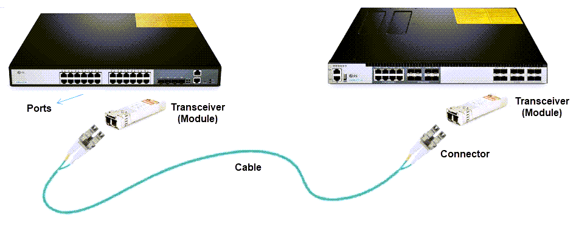

## Host Side vs. Media Side

Now that we understand the pluggable model, we can zoom in on the Transceiver Module itself. Because it acts as a translator, it inherently has two distinct "faces" or interfaces.

- **The Host Side (The Electrical Side)**: This is the back end of the transceiver that faces inward, plugging directly into the switch's Port (Cage). It interacts exclusively with the switch's internal hardware. It receives power and connects directly to the ASIC's electrical SerDes lanes via traces printed on the switch's internal circuit board. The host side is strictly defined by its form factor. Whether the module transmits light over 40 kilometers of fiber or drives electrical signals across 3 meters of copper, the physical host-side connector plugging into the switch looks and behaves exactly the same.

- **The Media Side (The Line Side)**: This is the front face of the transceiver that faces outward toward the rest of the network. It connects to the external Cable. This is where the actual translation happens. If it is an optical module, this side houses laser diodes and photodetectors. If it is a copper module, it houses an RJ45 jack and electrical conditioning circuits.

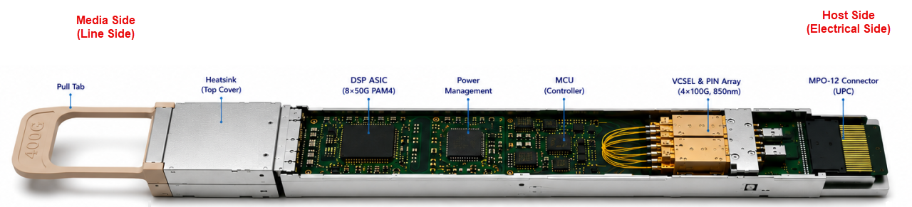

## Form Factor

Form factor defines both the physical size of the module and the number of high-speed electrical lanes (SerDes lanes) it exposes to the switch ASIC. As speeds increased over time, the industry scaled bandwidth by either increasing the per-lane data rate or by aggregating more lanes within a single module. Two main form factor families emerged to serve different markets: the **SFP / QSFP / OSFP** family for data center switching, and the **CFP** family for telecom and long-haul transport. This section covers both.

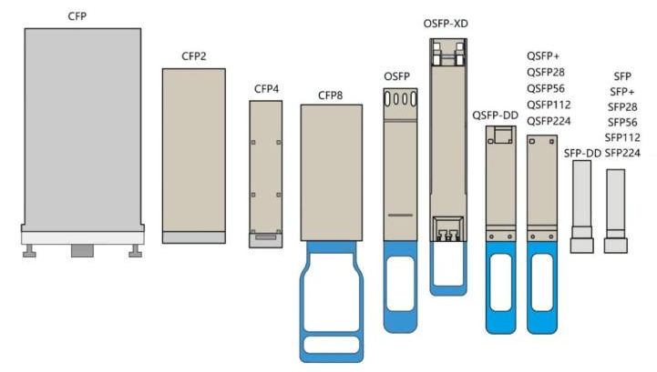

### Data Center Form Factors (SFP / QSFP / OSFP)

The `SFP` family is based on a single electrical lane per module. Starting from SFP (1G), each generation increases the per-lane signaling rate while keeping the mechanical size consistent: SFP+ (10G), SFP28 (25G), SFP56 (50G), and the emerging SFP112 (100G) and SFP224 (200G). The number in the name corresponds to the approximate per-lane signaling rate in Gbps, as defined by the OIF Common Electrical Interface specifications (CEI-28G, CEI-56G, CEI-112G, CEI-224G). The `SFP-DD` (Double Density) variant doubles the lane count from one to two, enabling 100G or 200G in the same compact SFP footprint. SFP-DD cages are backward compatible with single-lane SFP28 and SFP56 modules.

The `QSFP` family aggregates four electrical lanes in a larger mechanical envelope. The same generational progression applies: QSFP+ (40G), QSFP28 (100G), QSFP56 (200G), and the emerging QSFP112 (400G) and QSFP224 (800G). The `QSFP-DD` (Double Density) variant doubles the lane count from four to eight, supporting 400G and 800G. QSFP-DD cages are mechanically backward compatible with QSFP28 modules, so both module generations can use the same port.

For even higher densities, `OSFP` modules provide eight electrical lanes and are commonly used for 400G and 800G applications. The `OSFP-XD` (eXtra Density) variant targets 1.6T by running eight lanes at 200G PAM4. OSFP-XD maintains the same faceplate width as OSFP but uses a deeper housing to accommodate the increased power and thermal requirements. It is backward compatible with standard OSFP modules.

From SFP+ onward, each generation approximately doubles the per-lane signaling rate (10G → 25G → 50G → 100G → 200G). This means the same total speed can be achieved with fewer lanes (simpler optics, fewer fibers), or a higher total speed can be achieved with the same number of lanes. For example, 400G can be delivered by QSFP-DD with 8 × 50G lanes or by QSFP112 with just 4 × 100G lanes (half the lanes, next generation signaling).

| Form Factor  | Electrical Lanes (Host Side) | Typical Per-Lane Signaling | Common Total Speeds | Status            |
| ------------ | ---------------------------- | -------------------------- | ------------------- | ----------------- |
| **SFP**      | 1                            | 1G NRZ                     | 1G                  | Widely deployed   |
| **SFP+**     | 1                            | 10G NRZ                    | 10G                 | Widely deployed   |
| **SFP28**    | 1                            | 25G NRZ                    | 25G                 | Widely deployed   |
| **SFP56**    | 1                            | 50G PAM4                   | 50G                 | Deployed          |
| **SFP112**   | 1                            | 100G PAM4                  | 100G                | Emerging          |
| **SFP224**   | 1                            | 200G PAM4                  | 200G                | Early spec        |
| **SFP-DD**   | 2                            | 50G / 100G PAM4            | 100G / 200G         | Deployed          |
|              |                              |                            |                     |                   |
| **QSFP+**    | 4                            | 10G NRZ                    | 40G                 | Widely deployed   |
| **QSFP28**   | 4                            | 25G NRZ                    | 100G                | Widely deployed   |
| **QSFP56**   | 4                            | 50G PAM4                   | 200G                | Deployed          |
| **QSFP112**  | 4                            | 100G PAM4                  | 400G                | Emerging          |
| **QSFP224**  | 4                            | 200G PAM4                  | 800G                | Early spec        |
| **QSFP-DD**  | 8                            | 50G / 100G PAM4            | 400G / 800G         | Widely deployed   |
|              |                              |                            |                     |                   |
| **OSFP**     | 8                            | 50G / 100G PAM4            | 400G / 800G         | Widely deployed   |
| **OSFP-XD**  | 8                            | 200G PAM4                  | 1.6T                | Early spec        |

The total module speed is determined by:

    Per-lane speed × Number of lanes

### Telecom Form Factors (CFP Family)

CFP stands for **C Form-factor Pluggable**, where "C" represents centum (Latin for one hundred), reflecting its original 100G target speed. The CFP family was developed primarily for **telecom and service provider** networks, where long-haul coherent optics require significantly more internal space than short-reach data center modules.

Coherent optical transmission — used for distances of 80 km and beyond — requires complex internal components: tunable lasers, coherent receivers with local oscillators, high-power digital signal processors (DSPs), and thermoelectric coolers. In the early 2010s, these components could not physically fit inside a compact QSFP28 module. The CFP form factor addressed this by providing a much larger housing with higher power delivery, accommodating the full coherent optical engine.

As the CFP family evolved, each generation reduced the physical size while maintaining support for advanced optics:

| Form Factor | Electrical Lanes | Typical Speed | Relative Size (vs QSFP28) | Primary Domain           | Status              |
| ----------- | ---------------- | ------------- | ------------------------- | ------------------------ | ------------------- |
| **CFP**     | 10 × 10G NRZ     | 100G          | ~6× larger                | Telecom / long-haul      | Legacy              |
| **CFP2**    | 4 × 25G NRZ      | 100G / 200G   | ~3× larger                | Telecom / metro / DCI    | Still in use (coherent) |
| **CFP4**    | 4 × 25G NRZ      | 100G          | ~1.5× larger              | Telecom / metro          | Largely superseded  |
| **CFP8**    | 8 × 50G PAM4     | 400G          | ~3× larger                | Telecom / DCI            | Limited adoption    |

#### Why Two Form Factor Families Exist

The split between CFP and QSFP reflects a fundamental design tradeoff between **optical complexity** and **port density**:

- **Data center switches** prioritize fitting the maximum number of ports on a single front panel. Connections are short (typically under 2 km), so the optics are simple and compact. The SFP/QSFP/OSFP family is optimized for this: small modules, low power, high density.

- **Telecom and carrier equipment** prioritizes optical reach and signal quality over port count. A single coherent 400G link spanning 1,000 km requires optics far too large and power-hungry for a QSFP-DD module. The CFP family provides the physical space and power budget these applications demand.

#### Current Relevance

The CFP family is declining in relevance even within telecom. Advances in photonic integration have steadily shrunk coherent optical engines to the point where they now fit inside QSFP-DD modules (e.g., QSFP-DD ZR and ZR+ for 400G coherent over 80+ km). This convergence means the data center form factors are absorbing use cases that previously required CFP.

CFP2 remains in active use for certain coherent and DCI (Data Center Interconnect) applications where higher optical output power or specialized wavelength tunability exceeds what QSFP-DD can deliver. However, new platform designs increasingly favor QSFP-DD and OSFP exclusively.

For data center switching platforms — including the DX010 with its QSFP28 ports — CFP modules are physically incompatible and not applicable.

## QSFP28 Transceiver Interface

QSFP28 is a 100G-generation form factor that carries 4 electrical lanes at 25G NRZ per lane. When a QSFP28 transceiver is inserted into a port, it connects to the host hardware across three distinct interfaces: power, management, and data. Power and management are entirely host-side interfaces, while the data interface spans both the host side and the media side of the module.

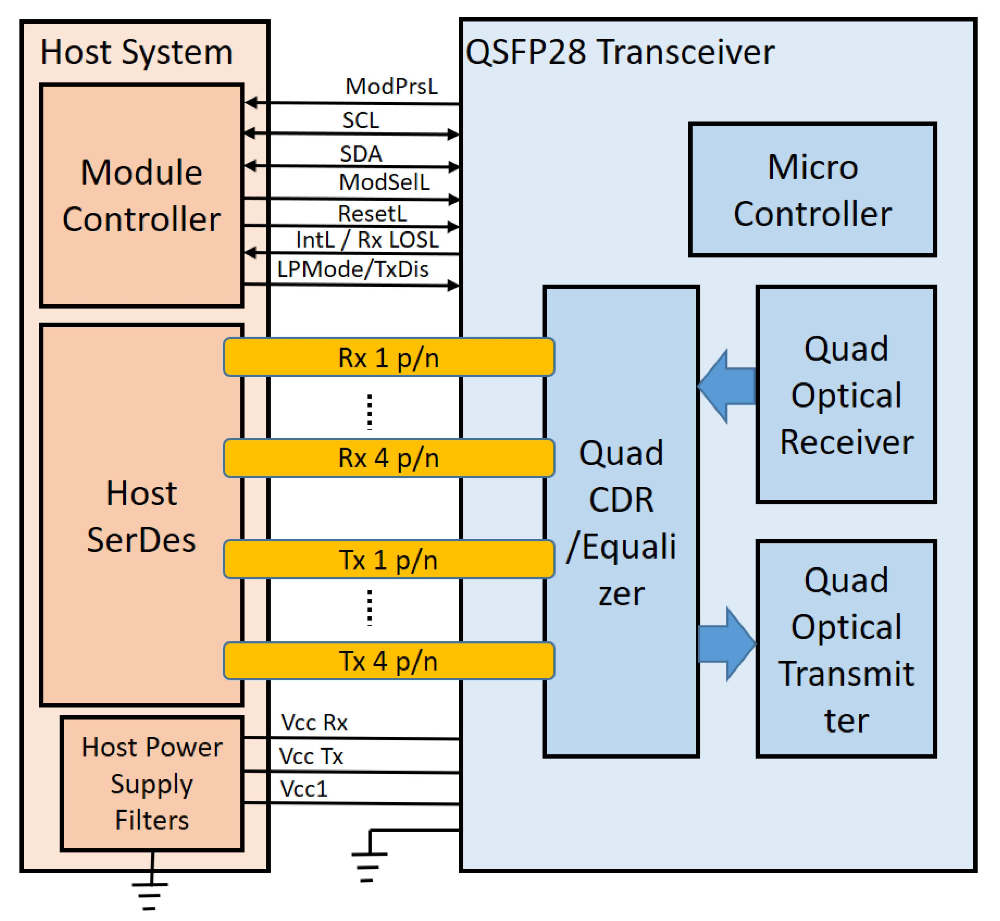

### Power Interface

Before any data can flow, the module must be powered. The "Host Power Supply Filters" deliver 3.3V to the module through the `Vcc Rx`, `Vcc Tx`, and `Vcc1` pins (shown at the bottom of the diagram). Power is distributed across multiple **Vcc** pins rather than a single contact. Spreading current over several pins reduces voltage drop, lowers current density per contact, prevents localized heating, and improves long-term connector reliability.

The QSFP28 connector uses **staggered contact** lengths to support hot-plug insertion. During mating, ground pads connect first (sequence 1), power pads second (sequence 2), and signal pads last (sequence 3). During removal the order reverses. This ensures the module is grounded and static is safely discharged before power is applied, and power is stable before signals become active. The pin layout below shows this sequencing across the 38-pad edge connector:

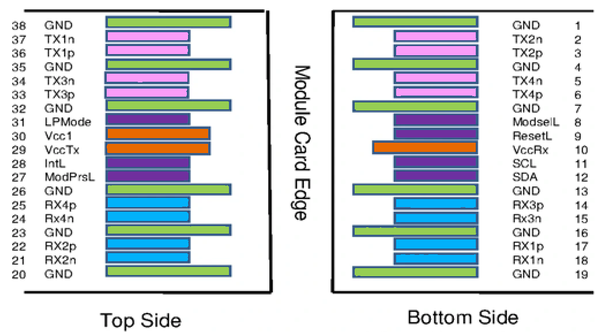

### Management Interface (Low-Speed)

Once powered, the host must identify the module (vendor, serial number, capabilities) and monitor its health. This is handled by the Module Controller on the host side, typically driven by a management CPU — not the switching ASIC.

The CPU communicates with the module's internal Microcontroller over an I2C bus (`SCL` clock and `SDA` data lines shown at the top of the diagram). The remaining management pins provide hardware-level control and status:

- `ModPrsL` — Module present (active low); the module asserts this pin to tell the host it is physically inserted.
- `ModSelL` — Module select (active low); the host asserts this pin to address this specific module on a shared I2C bus.
- `ResetL` — Module reset (active low); the host can force a hardware reset.
- `IntL / Rx LOSL` — Interrupt and RX loss-of-signal (active low); the module alerts the host to faults or state changes.
- `LPMode / TxDis` — Low-power mode and transmit disable; the host can force the module into a low-power state or shut down its optical transmitters.

The software interface for this I2C communication is **SFF-8636** for QSFP28 and earlier form factors, or **CMIS** (Common Management Interface Specification) for newer form factors such as QSFP-DD and OSFP. Both are covered in detail in [Transceiver Management Interface](02_README_module_mgmt.md).

### Data Interface (High-Speed)

After the module is powered and recognized, network traffic can flow.

- **Host side:** The switch ASIC's SerDes lanes connect to the module through 4 TX and 4 RX [differential pairs](https://github.com/ManiAm/net-lab-switch-serdes/blob/master/docs/02_README_serdes.md#differential-signaling) — denoted `Tx 1 p/n` through `Tx 4 p/n` for transmit, and `Rx 1 p/n` through `Rx 4 p/n` for receive (where `p/n` indicates the positive and negative conductors of each pair). Each lane carries 25 Gb/s NRZ, delivering 100 Gb/s aggregate in each direction.

    GND pins are interleaved between every signal group. These ground pads provide controlled return paths for high-frequency currents, maintain trace impedance, minimize crosstalk between adjacent lanes, and reduce electromagnetic interference. Without proper return paths, [eye diagrams](https://github.com/ManiAm/net-lab-switch-serdes/blob/master/docs/03_signal_basics.md#eye-diagram) would degrade and bit error rates would increase.

- **Media side:** The module converts between the host electrical domain and the external optical medium. For an optical QSFP28, the media side contains a Quad Optical Transmitter (four laser sources) and a Quad Optical Receiver (four photodetectors). The connector type depends on the optical architecture: parallel-lane variants use an MPO connector, while wavelength-multiplexed variants use a duplex LC connector (see [Optical Transceiver Naming](#optical-transceiver-naming) for the general rule).

## Media-Side Cabling

The media side of a transceiver connects to the external network through a cable or integrated assembly. Four cabling architectures are common in practice, each offering a different balance of flexibility, cost, reach, and serviceability.

### Modular Optical

Modular optical connectivity separates the transceiver from the fiber cable. The switch port provides a high-speed electrical interface, a pluggable optical transceiver converts that signal to light, and a removable fiber patch cable connects two devices. Because the optics and the cable are independent components, each can be selected based on distance and application. The [Optical Transceiver Reach Standards](#optical-transceiver-reach-standards) section defines the standard distance classes available.

This model provides maximum flexibility and serviceability. If a fiber cable is damaged, only the cable is replaced. If distance requirements change, the transceiver can be swapped without replacing the switch. Optical transceivers also support Digital Optical Monitoring (DOM), which provides real-time telemetry including TX/RX optical power (in dBm), laser bias current, module temperature, and supply voltage. This data is accessible through the module's management interface and is invaluable for link troubleshooting and preventive maintenance.

Modular optics are therefore the standard choice for structured data center cabling, campus links, and any environment where scalability and long-term adaptability are important.

### DAC (Direct Attach Copper)

A "Direct Attach Copper" cable integrates the copper twinax cable and the transceiver heads into a single, permanently attached assembly. It plugs directly into SFP, QSFP, or OSFP ports without requiring separate modules. DACs are passive (most common for short reach) or active (for slightly longer distances), but both are designed primarily for short connections — typically 1 to 5 meters.

DACs are cost-effective and energy-efficient because they avoid optical conversion and laser components. They are widely used for intra-rack connections, such as connecting a top-of-rack switch to servers in the same cabinet. However, copper attenuation increases quickly with length, limiting practical distance and cable manageability compared to fiber.

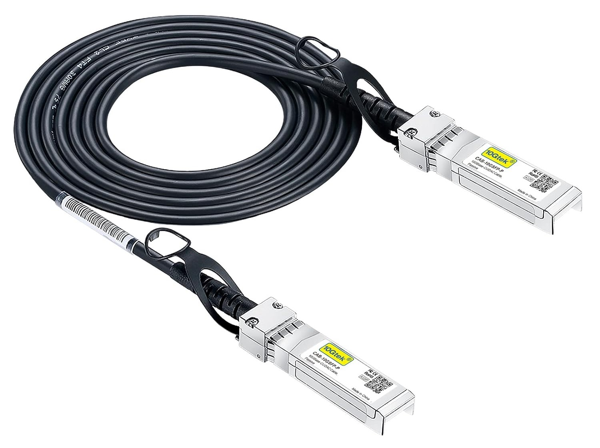

### AOC (Active Optical Cable)

An "Active Optical Cable" combines fiber and optical transceivers into a single, factory-assembled unit. Unlike DAC, the signal is converted to light inside the fixed module heads, and the integrated fiber cable carries the optical signal between endpoints. AOCs are available in lengths from 1 m to 100 m, giving them a significant reach advantage over DAC. They are also lighter and more flexible than copper twinax, making them easier to route through dense cable trays.

Because the optical engines are permanently attached, the entire cable assembly must be replaced if one end fails. AOCs offer a balance between the simplicity of DAC and the reach advantages of modular optics. They are commonly used for rack-to-rack connections within the same row or adjacent rows in data centers, particularly in the 5–30 m range where DAC cannot reach but deploying separate transceivers and fiber is not justified.

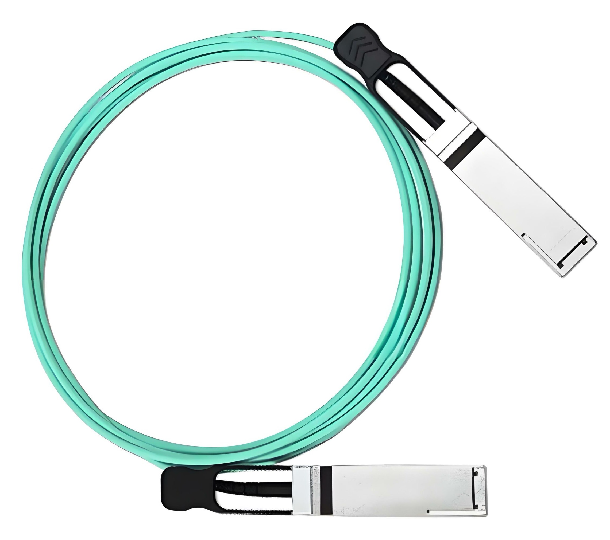

### Base-T Copper Module

A Base-T solution uses a pluggable transceiver with an RJ45 interface that fits into an SFP or QSFP cage. It enables the use of standard twisted-pair Ethernet cabling such as Cat6 or Cat6A. The module performs the electrical PHY processing internally, translating high-speed serial data from the switch into the multi-level signaling required for copper Ethernet transmission.

While Base-T provides compatibility with structured building cabling and legacy Ethernet infrastructure, it generally consumes more power and introduces higher latency than DAC or optical solutions. For high-density, high-speed data center environments, DAC or optical modules are typically preferred. Base-T is most suitable when integration with existing copper infrastructure is required or when cost-effective short- to medium-distance links are sufficient.

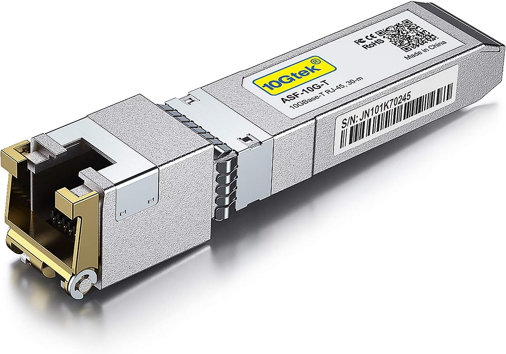

## Optical Transceiver Reach Standards

Optical transceiver reach codes define the operational class of a module. Each code specifies:

- Maximum supported distance
- Required fiber type
- Typical connector style
- Relative power and thermal profile
- Intended deployment environment

These standards allow network designers to quickly determine whether a module is appropriate for short intra-rack links, large data center fabrics, or long-haul interconnects between buildings or cities.

| Acronym | Full Name              | Distance (Reach)   | Fiber Mode    | Typical Connector | Power Draw | Primary Use Case                            |
| ------: | ---------------------- | ------------------ | ------------- | ----------------- | ---------- | ------------------------------------------- |
|  **SR** | Short Reach            | ~100 m             | MMF           | LC or MPO         | Low        | Server to Top-of-Rack                       |
|  **DR** | Datacenter Reach       | ~500 m             | SMF           | LC or MPO         | Medium     | Spine-Leaf inside data center               |
|  **FR** | Fiber Reach            | ~2 km              | SMF           | LC                | Med-High   | Large data halls / inter-floor              |
|  **LR** | Long Reach             | ~10 km             | SMF           | LC                | High       | Campus / building backbone                  |
|  **ER** | Extended Reach         | ~40 km             | SMF           | LC                | Higher     | Metro edge / regional links                 |
|  **ZR** | ZR                     | ~80 km             | SMF           | LC                | Very High  | Data Center Interconnect (DCI)              |
| **ZR+** | Extended ZR (Coherent) | 80 km+             | SMF           | LC                | Highest    | Long-haul / coherent DCI / carrier networks |

A fundamental principle governs all reach categories: as transmission distance increases, optical complexity increases. Longer distances require stronger laser output, more advanced modulation techniques, and more sophisticated digital signal processing (DSP) to compensate for attenuation and dispersion in the fiber. This results in higher power consumption and greater thermal demands on the switch.

### `SR` – Short Reach

SR modules are designed for short-distance links (typically up to 100 meters) over multimode fiber, commonly OM3 or OM4. They operate at 850 nm using VCSEL-based transmitters, which are relatively simple and power-efficient. SR optics are widely used for server-to-switch and rack-to-rack connectivity inside data centers. Because multimode fiber is optimized for short runs, SR modules represent the lowest power and lowest complexity class of optical transceivers. Connectors are typically LC for duplex variants or MPO for multi-lane high-speed implementations such as SR4 or SR8.

### `DR` – Data Center Reach

DR modules support medium-range links of approximately 500 meters over single-mode fiber. They are commonly deployed in spine–leaf topologies within modern data centers where single-mode infrastructure is preferred for scalability. Compared to SR, DR optics use higher-performance lasers and often parallel lane architectures (e.g., DR4). Power consumption is higher than SR due to tighter signal control requirements, but still optimized for data center environments.

### `FR` – Fiber Reach

FR modules extend transmission distance to roughly 2 kilometers over single-mode fiber. They are typically used for connections across large data center halls or between buildings within a campus. Unlike SR and DR, which use parallel fibers, FR modules use wavelength division multiplexing (WDM) to carry multiple lanes over a single fiber pair — for example, FR4 carries four wavelengths on one duplex LC connector. The increased span requires stronger optical components and more advanced signal conditioning than DR, resulting in higher power consumption.

### `LR` – Long Reach

LR modules support distances of approximately 10 kilometers over single-mode fiber and are widely used for building-to-building campus backbones. At this range, chromatic dispersion and attenuation become more significant, requiring higher laser output and more sophisticated signal compensation. Consequently, LR modules consume more power and generate more heat than FR or DR classes. LR optics typically use duplex LC connectors and direct-detect modulation.

### `ER` – Extended Reach

ER modules extend optical reach to approximately 40 kilometers over single-mode fiber. These modules are commonly used for metro edge connectivity and regional interconnects between data centers within a metropolitan area. Compared to LR, ER optics require higher optical launch power, improved receiver sensitivity, and tighter dispersion control. Power consumption increases further due to the expanded optical budget and signal management requirements. ER modules remain primarily direct-detect designs but operate near the upper practical limits of that architecture.

### `ZR`

ZR modules are engineered for long-haul links of approximately 80 kilometers and are commonly deployed in Data Center Interconnect (DCI) applications. At this distance, direct-detect techniques are insufficient. ZR is defined as a coherent standard (e.g., OIF 400ZR), meaning the module uses coherent modulation with an integrated DSP engine capable of compensating for chromatic dispersion, polarization mode dispersion, and other long-distance impairments. These modules represent a significant increase in complexity and power consumption compared to SR–ER classes.

### `ZR+` – Extended ZR (Coherent Extended Reach)

ZR+ is an enhanced, often MSA-defined or vendor-extended version of ZR that supports distances beyond 80 kilometers, frequently ranging from 100 km to several hundred kilometers depending on system design. ZR+ modules are fully coherent pluggables with powerful DSP engines and advanced modulation formats (e.g., higher-order QAM). They are used in long-haul DCI and carrier-grade backbone networks. ZR+ optics consume the highest power among pluggable modules due to the complexity of coherent signal processing and extended optical budgets.

## Optical Transceiver Naming

Optical module names follow a standardized format:

    [Speed] – [Reach Code][Lane Count]

Each part of this name communicates important technical information about how the module operates.

- **Speed** defines the total data rate (e.g., 100G, 400G, 800G).
- **Reach Code** defines the supported distance and fiber type.
- **Lane Count** defines how many parallel optical channels are used to achieve the total speed.

For example, `400G-DR4` means:

- 400G → Total bandwidth of 400 gigabits per second
- DR → Data Center Reach (single-mode fiber, ~500 meters)
- 4 → Four optical lanes

The lane count determines how many independent optical channels carry the total bandwidth, and this directly determines the cabling architecture (see [Bandwidth Scaling](03_README_fiber.md#bandwidth-scaling) for the underlying concepts):

- **Lane count = 1** (or not shown, e.g., `100G-LR`): The module uses wavelength multiplexing to fit all channels onto a single fiber pair. Cabling requires only two fibers and a duplex LC connector.
- **Lane count > 1** (e.g., DR4, SR8): The module uses parallel optics — each lane occupies a dedicated fiber. A 4-lane module requires 8 fibers (4 TX + 4 RX), an 8-lane module requires 16 fibers (8 TX + 8 RX), and these are terminated with a multi-fiber MPO connector.

## Breakout Cables

[Port breakout](https://github.com/ManiAm/net-lab-switch-serdes/blob/master/docs/02_README_serdes.md#ports-and-breakout) splits a single high-speed port into multiple lower-speed logical interfaces by remapping the ASIC's SerDes lanes. From a cabling perspective, breakout determines which cables and connectors are needed to physically fan out the port. Whether the transceiver must be changed depends on the cabling architecture in use.

Common breakout configurations and their typical cabling:

| Source Port | Breakout | Lanes per Sub-Port | Typical Cable |
| ----------- | -------- | ------------------ | ------------- |
| 800G OSFP   | 8 × 100G | 1 lane @ 100G PAM4 | OSFP → 8×QSFP28 or 8×SFP112 |
| 400G QSFP-DD| 4 × 100G | 2 lanes @ 50G PAM4 | QSFP-DD → 4×QSFP28 |
| 100G QSFP28 | 4 × 25G  | 1 lane @ 25G NRZ   | QSFP28 → 4×SFP28 |
| 40G QSFP+   | 4 × 10G  | 1 lane @ 10G NRZ   | QSFP+ → 4×SFP+ |

### Scenario A: DAC (Direct Attach Copper)

In a DAC setup, the cable and module ends are permanently fused together as a single assembly. Because the cable cannot be detached from the transceiver heads, converting from a straight connection to breakout requires replacing the entire unit. A standard DAC must be removed and replaced with a breakout DAC that has one high-speed connector on the switch side and multiple lower-speed connectors on the device side. No components can be reused in this model.

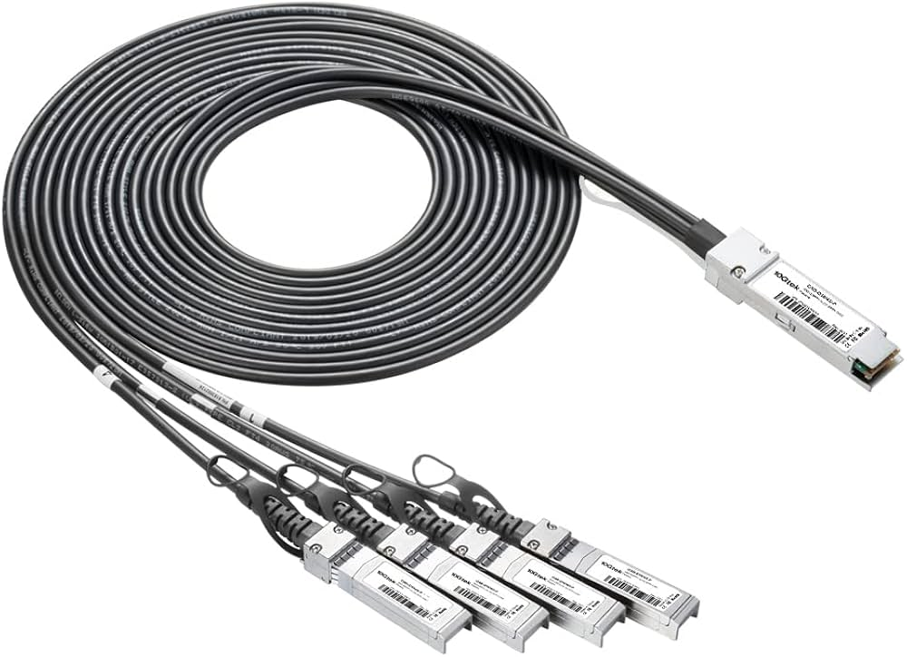

### Scenario B: AOC (Active Optical Cable)

An AOC behaves similarly to a DAC in terms of mechanical structure. The optical cable and module heads are permanently integrated into a single assembly. To enable breakout, the straight AOC must be replaced entirely with a breakout AOC. Although AOCs are lighter and support longer distances than DACs, they still require swapping the full assembly when changing topology.

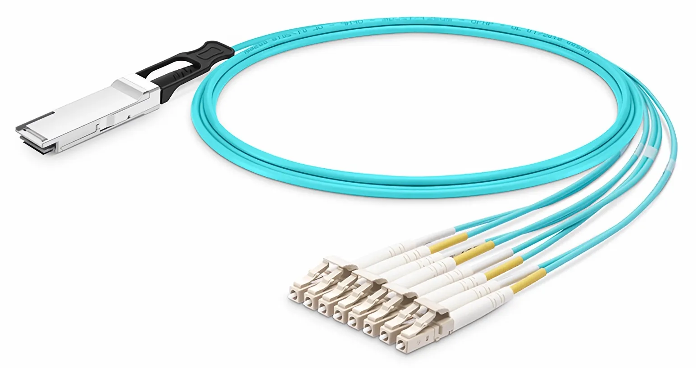

### Scenario C: Modular Optical (Separate Transceiver + Fiber)

In a modular optical setup, the transceiver and fiber cable are separate components. The breakout behavior is achieved by changing only the fiber cable while keeping the transceiver installed. For example, a straight MPO trunk cable can be replaced with an MPO-to-LC "hydra" breakout cable. This approach offers greater flexibility and lower long-term cost, because cables can be replaced independently without discarding the more expensive optical module.

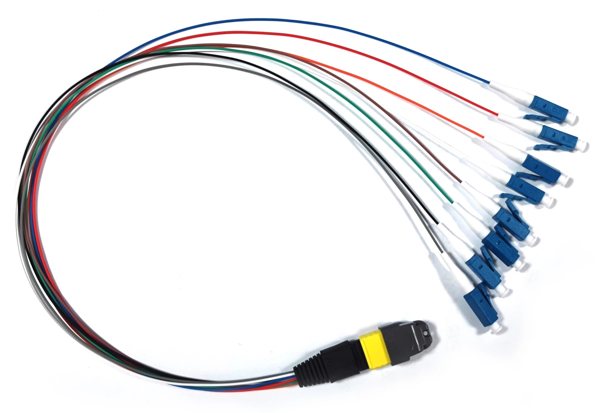

## Loopback Module

A loopback module is a special test device that physically resembles a standard pluggable transceiver but does not transmit data over any external medium. Instead, it internally routes the transmit (TX) signals directly back to the receive (RX) inputs. Whatever the switch sends out is immediately returned to its own receiver lanes, allowing engineers to test and validate ports without external cables, optics, or remote equipment.

Loopback modules are available in two types:

- **Electrical loopback**: A passive device that routes the host's electrical TX signals directly back to the RX pins within the module housing. It requires no power and introduces no optical conversion. This is the most common and least expensive type, suitable for verifying port functionality, SerDes lane integrity, and basic link-up behavior.

- **Optical loopback**: Contains active optical components (laser and photodetector) that convert the electrical TX signal to light and then immediately convert it back to an electrical RX signal — all within the module. These are used to test the full electro-optical path including the laser driver and TIA, but are more expensive and less common for routine testing.

Loopback modules are available for all standard form factors including SFP+, SFP28, QSFP+, QSFP28, QSFP-DD, and OSFP. They are primarily used in:

- **Port bring-up and manufacturing test**: Verifying that each port on a new or refurbished switch functions correctly before deployment.
- **Field troubleshooting**: Isolating whether a link failure is caused by the local port, the remote port, or the cable between them.
- **Systematic port validation**: Testing all ports on a switch without needing a matching number of cables and remote devices.

## Optical Integration Architectures

The fundamental challenge in high-speed switch design is the physical distance between the ASIC and the optical transceiver. Electrical signals degrade rapidly at modern lane rates (50–200 Gb/s) as they travel across PCB traces, vias, and connectors. The longer this electrical path, the more signal integrity is lost to attenuation, reflections, and crosstalk.

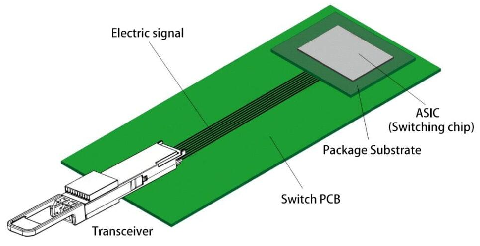

Three architectural approaches address this problem, each trading off power, complexity, and serviceability differently.

### NPO (Near-Package Optics)

Near-Package Optics (NPO) is the conventional pluggable architecture used in most switches today. The optics remain in a front-panel pluggable module (such as QSFP-DD or OSFP), with the electrical path between the ASIC and module spanning 10–30 cm. To compensate for signal degradation over this distance, the module contains a **Digital Signal Processor (DSP)** that performs equalization, clock data recovery, and signal reshaping.

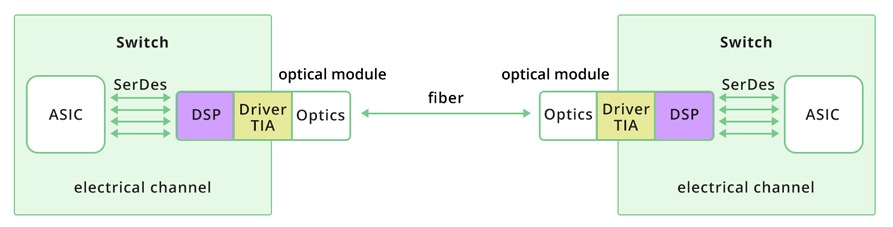

- Signal path (Transmit): ASIC → SerDes → DSP → Driver → Optics → Fiber

    On the transmit side, the switch `ASIC` generates high-speed electrical data streams, typically using PAM4 modulation. These signals are serialized by the `SerDes` and travel across the switch PCB to the pluggable optical module. The module's `DSP` performs equalization and signal conditioning to clean and reshape the waveform after its lossy journey across the board. After processing, the `Driver` converts the conditioned electrical signal into a precise modulation current that drives the optical components. The `Optics` (consisting of lasers and modulators) then converts the electrical signal into modulated light and transmits it over fiber.

- Signal path (Receive): Fiber → Optics → TIA → DSP → SerDes → ASIC

    On the receive side, incoming light from the fiber enters the optical front-end, where a photodetector converts optical energy into a very small electrical current. That current is amplified by a Transimpedance Amplifier (`TIA`), which converts the current into a usable voltage signal. The `DSP` then performs equalization, noise filtering, and clock data recovery to reconstruct a clean digital bitstream. Finally, the recovered signal is passed through the `SerDes` and delivered back to the `ASIC`.

The following diagram shows the signal path in more detail:

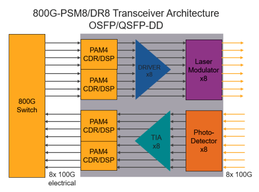

This architecture is DSP-intensive and consumes more power compared to linear designs, but it offers high tolerance to channel imperfections. Its primary advantages are robustness, flexibility, and interoperability — the DSP decouples the module's optical performance from the host platform's electrical channel quality, meaning the same module works reliably across different switch designs. This is why NPO remains the most widely deployed solution in high-speed networking systems today.

### LPO (Linear Pluggable Optics)

LPO retains the same pluggable form factor (the module is still inserted into a standard cage) but changes the internal architecture. Instead of relying on a heavy digital signal processor (DSP) inside the module, LPO uses a more direct, linear electrical path between the ASIC SerDes and the optical components. The module performs minimal signal correction, meaning the host system must provide a cleaner, well-conditioned electrical channel.

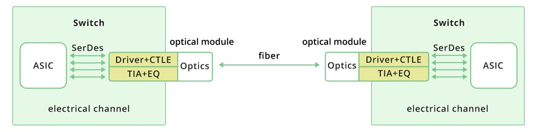

- Signal path (Transmit): ASIC → SerDes → Driver + Linear Equalization → Optics → Fiber

    On the transmit side, the ASIC generates high-speed PAM4 signals through its SerDes lanes, which are sent directly to the module's driver stage with only lightweight linear equalization. The driver converts the electrical signal into modulation current for the optical transmitter, which then launches the signal onto the fiber. Because no DSP reshaping occurs inside the module, signal integrity depends heavily on the quality of the PCB traces, connectors, and ASIC SerDes tuning.

- Signal path (Receive): Fiber → Optics → TIA + Linear EQ → SerDes → ASIC

    On the receive side, incoming optical signals are converted into electrical current by the photodetector. The TIA (Transimpedance Amplifier) amplifies this current and applies basic linear equalization before passing the signal directly to the ASIC's SerDes. Without DSP-based recovery inside the module, the ASIC must handle tighter signal margins and compensate for any remaining impairments.

The primary advantage of LPO is reduced power consumption and lower latency compared to DSP-based pluggables. The tradeoff is increased sensitivity to system design including board layout, trace length, connector quality, SerDes calibration, and environmental stability. LPO is best suited for short-reach, high-density deployments such as AI fabrics, where power per port is critical and the cabling environment is tightly controlled.

### CPO (Co-Packaged Optics)

CPO moves optics from a removable front-panel module to optical engines placed adjacent to (or integrated with) the switch ASIC package. The electrical path between the SerDes and the optical engine becomes extremely short — millimeters instead of the 10–30 cm PCB runs in NPO — eliminating most of the signal integrity penalty associated with high-speed electrical lanes traversing long board traces and connectors.

CPO offers the best path to higher bandwidth density and lower power per bit as lane rates scale beyond 200G. The trade-off is operational and manufacturing complexity. The pluggable serviceability model is lost: replacing a failed optical engine may require removing an engine assembly, a tray, or in some designs a larger portion of the system. CPO also introduces new challenges in thermal management, manufacturing yield, production test strategy, and field replaceability.
