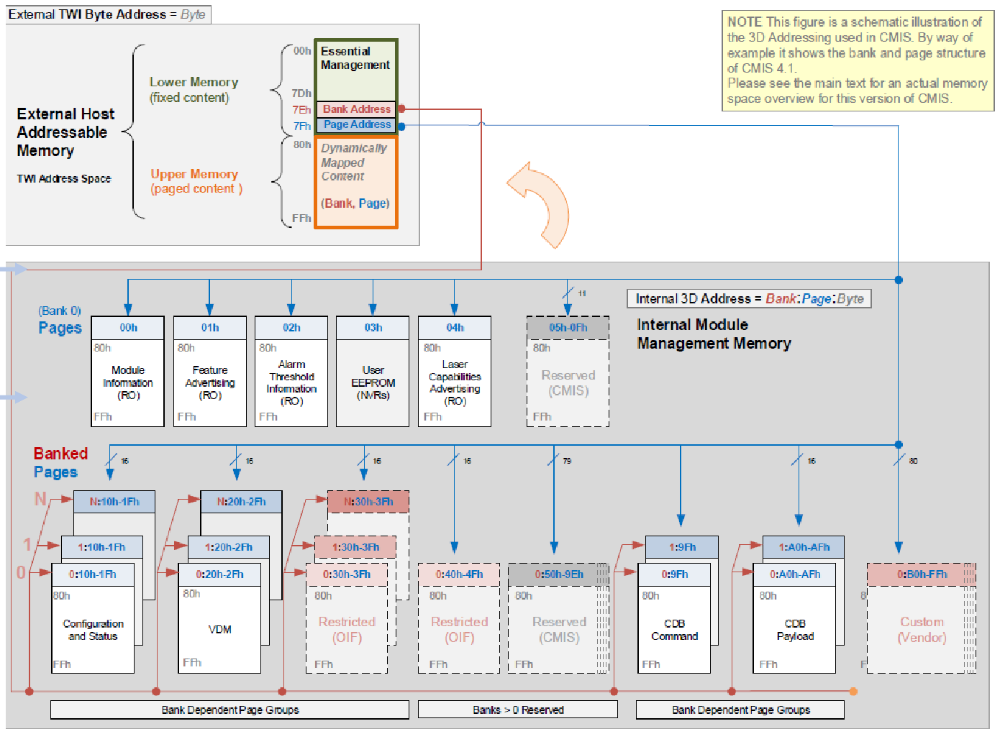

# Transceiver Management Interface

As established in the [previous document](01_README_module.md), a pluggable transceiver connects to its host through three distinct interfaces: power, data, and management. While the power interface energizes the module and the data interface carries high-speed network traffic over SerDes lanes, the management interface allows the host to identify, monitor, and control the module over a low-speed serial bus. Because this bus is physically separate from the data lanes, management is independent of traffic flow — the host can discover and configure a module before enabling traffic, and continue monitoring health even if the data path is down.

Without a management interface, a transceiver would be a black box. The host would have no way to determine the module's vendor, speed capabilities, or media type. It could not monitor operating temperatures, detect a failing laser, or disable a transmitter. Ultimately, the management interface transforms a pluggable module from a passive electrical-to-optical converter into an intelligent device that the host can discover, supervise, and configure through software.

## The Foundation: Static vs. Dynamic Data

To understand how management interfaces are structured and how they have evolved, it is essential to first understand the two distinct types of data they handle. The memory architecture of any transceiver is specifically designed to accommodate both.

### Static Data (Identity)

Static data represents immutable manufacturing and identity information stored in non-volatile memory. This data allows the host to identify the module and apply the correct configuration profiles. Examples include:

- Vendor name and part number
- Serial number and manufacturing date
- Hardware revision
- Cable length or media type

### Dynamic Data (Telemetry)

Dynamic data represents real-time operating conditions. These values are not stored permanently; instead, the module continuously samples internal sensors, and the host retrieves the latest readings on demand. This acts as a live operational dashboard. Examples include:

- Module temperature
- Supply voltage (Vcc)
- Laser bias current
- Transmit and receive optical power
- Digital Signal Processor (DSP) metrics (e.g., pre-FEC BER)

## The Evolution of the Management Interface

Over the last two decades, the transceiver management interface underwent two parallel transformations:

- **Physical Implementation**: Transitioned from standalone passive EEPROM chips to embedded microcontrollers (MCUs) equipped with flash memory and RAM.

- **Software Contract**: Evolved from serving static identity bytes to handling live diagnostics, complex paging, and state machines.

Despite these internal changes, the host has always used the same physical bus: I²C (SDA/SCL), located on the management pins described in the [QSFP28 Transceiver Interface](./01_README_module.md#qsfp28-transceiver-interface) section. Network Operating Systems (NOS) and diagnostic tools still frequently refer to reading this data as an "EEPROM read" because the interface is designed to emulate a memory map even when a modern MCU is answering on the other end.

| Specification  | Era   | Typical Form Factors  | Key Advancement |
|----------------|-------|-----------------------|-----------------|
| MSA / INF-8074 | ~2000 | SFP                   | Static identity only (`A0h` EEPROM) |
| SFF-8472       | ~2007 | SFP, SFP+, SFP28      | Digital Optical Monitoring via second address (`A2h`) |
| SFF-8636       | ~2013 | QSFP+, QSFP28         | Multi-lane paged register map with per-lane control |
| CMIS           | ~2017 | QSFP-DD, OSFP, SFP-DD | Firmware state machines, application selection, CDB |

### MSA / INF-8074: Identity Only (The Baseline)

The earliest pluggable modules were simple optical assemblies with little to configure beyond a basic transmit (TX) disable. Their management interface was defined by the original **Multi-Source Agreement (MSA)**, specifically INF-8074. This baseline standard dictated that the module must contain a passive EEPROM answering at a specific I²C address (`A0h`). The host read this fixed address to retrieve factory-programmed static data, such as vendor name and serial number. In this era, no processing logic existed between the host and the data.

The [Cisco GLC-SX-MM](https://www.telquestintl.com/site/Product%20Manuals/Cisco%20GLC-SX-MM%20data%20sheet.pdf) is an example transceiver that relies entirely on this original MSA standard. As a legacy 1G short-reach optic, it acts purely as a passive EEPROM on the I²C bus. It answers only at address `A0h` to provide the switch with its static identity data, offering no digital optical monitoring or live health diagnostics.

### SFF-8472: Digital Optical Monitoring (The Extension)

As optics became more sophisticated (generating more heat and utilizing more complex lasers), network operators needed a way to monitor their health in real time. However, the industry could not simply change the original `A0h` memory map without breaking backward compatibility with older switches.

To solve this, a new specification was authored: **SFF-8472**. This standard extended the original SFP management interface by bolting on a second, separate I²C address (`A2h`). This new memory space was dedicated entirely to **Digital Diagnostic Monitoring (DDM/DOM)**, allowing the host to read dynamic data like temperature, voltage, and optical power. To achieve this, modules began incorporating small controllers or monitor ICs to sample sensors in real time and populate this new `A2h` memory map, while still serving the static identity data at the original `A0h` address.

The Cisco SFP-10G-SR is an example transceiver that utilizes the SFF-8472 extension. Built for 10G short-reach connections, it features internal monitoring hardware that constantly measures module temperature, laser bias current, and optical transmit/receive power, feeding those live metrics to the host switch through the secondary `A2h` memory address.

### SFF-8636: Multi-Lane Control (The Scaling Phase)

The advent of 40G/100G QSFP modules introduced four host lanes, per-lane TX disable, larger memory paging (beyond 256 bytes), and richer alarm flags. **SFF-8636** standardized this new register layout. Internally, most QSFP28 modules utilize an MCU to aggregate diagnostics and process control writes. However, SFF-8636 only dictates the register map; the internal state machine and firmware execution are left to the vendor's discretion.

The Cisco QSFP-100G-SR4-S is an example transceiver that relies on the SFF-8636 management map. Because it drives four parallel optical lanes (4x25G) to achieve 100G speeds, it uses an internal microcontroller to reorganize its memory map according to SFF-8636. This allows the host switch to monitor diagnostics, trigger alarms, or disable transmitters for each of the four lanes independently.

### CMIS: Firmware-Centric Management (The Modern Era)

With 400G and 800G modules came eight host lanes, highly complex DSPs, multiple operating modes (e.g., 1×400G vs. 4×100G), and field-upgradable firmware. The **Common Management Interface Specification (CMIS)** was developed for this era. CMIS fundamentally assumes the presence of an MCU running firmware, and it dictates a large, banked memory map with formally defined state machines and initialization sequences.

The Cisco QDD-400G-DR4-S (QSFP-DD) is an example transceiver that requires CMIS to function. As a modern 400G optic containing a complex DSP and advanced thermal management, it operates more like an embedded computer than a simple laser. It runs live, upgradable firmware and uses CMIS state machines to safely initialize its high-power components and negotiate operational modes with the host switch.

## SFF-8472

**Full name:** SFF-8472 — Diagnostic Monitoring Interface for Optical Transceivers

**Published by:** SFF Committee (under SNIA — Storage Networking Industry Association)

| Form Factor | Typical Data Rate |
|-------------|-------------------|
| SFP         | 1G                |
| SFP+        | 10G               |
| SFP28       | 25G               |

SFF-8472 is the management interface standard for single-lane SFP-family transceivers. It extends the original MSA/INF-8074 baseline by adding a second I²C address (`A2h`) dedicated to real-time diagnostics, while preserving the legacy identification data at the original address (`A0h`). This dual-address design allowed the industry to introduce live telemetry without modifying the existing `A0h` memory layout, maintaining backward compatibility with older host systems.

### Dual-Address Memory Model

SFF-8472 modules present two independent 256-byte memory spaces on the I²C bus:

- **Address `A0h` — Module Identification**
    - Vendor name, part number, serial number
    - Connector type and compliance codes
    - Wavelength and link length capabilities
- **Address `A2h` — Diagnostics and Control**
    - Real-time sensor readings
    - Alarm/warning thresholds
    - Status flags and control bits

The host accesses these as two separate I²C devices on the same bus. Reading identity data is a read to address `A0h`; reading diagnostics is a read to address `A2h`. Each address space is a flat 256-byte block.

### A0h: Module Identification

The A0h address space contains factory-programmed static data. Key fields include:

| Byte(s) | Field                      | Description        |
|---------|----------------------------|--------------------|
| 0       | Identifier                 | Module type (e.g., `0x03` = SFP/SFP+/SFP28). |
| 2       | Connector Type             | Physical connector (e.g., LC, copper pigtail). |
| 3–10    | Compliance Codes           | Supported standards (Ethernet, Fibre Channel, SONET/SDH). |
| 12–19   | Link Length                | Maximum reach for each supported fiber type and wavelength. |
| 20–35   | Vendor Name                | 16-byte ASCII vendor identification. |
| 40–55   | Vendor Part Number         | 16-byte ASCII part number. |
| 60–61   | Wavelength                 | Laser wavelength in nm (or copper attenuation for passive cables). |
| 63      | CC_BASE                    | Checksum over bytes 0–62 for data integrity verification. |
| 68–83   | Vendor Serial Number       | 16-byte ASCII serial number. |
| 84–91   | Date Code                  | Manufacturing date in YYMMDD format plus vendor lot code. |
| 92      | Diagnostic Monitoring Type | Indicates DDM capabilities: internal/external calibration, power measurement type. |
| 95      | CC_EXT                     | Checksum over bytes 64–94. |

Byte 92 is important for host software. It tells the host whether the module supports DDM at all, whether diagnostic values at A2h are internally calibrated (directly usable) or externally calibrated (requiring host-side computation), and whether received power is measured as average power or OMA (Optical Modulation Amplitude).

### A2h: Digital Diagnostic Monitoring (DDM)

The A2h address space contains real-time operational data organized into three functional regions.

**Alarm and warning thresholds (bytes 0–39):** Factory-set limits for each monitored parameter. Each of the five parameters has four thresholds — high alarm, low alarm, high warning, and low warning — stored as 2 bytes each (5 parameters × 4 thresholds × 2 bytes = 40 bytes).

**Real-time diagnostic values (bytes 96–105):** Five parameters continuously measured by the module:

| Byte(s) | Parameter            | Format          | Resolution |
|---------|----------------------|-----------------|------------|
| 96–97   | Temperature          | Signed 16-bit   | 1/256 °C |
| 98–99   | Supply Voltage (Vcc) | Unsigned 16-bit | 100 µV |
| 100–101 | TX Bias Current      | Unsigned 16-bit | 2 µA |
| 102–103 | TX Output Power      | Unsigned 16-bit | 0.1 µW |
| 104–105 | RX Received Power    | Unsigned 16-bit | 0.1 µW |

**Status and control (bytes 110–117):**

| Byte(s) | Function |
|---------|----------|
| 110     | **Status/Control** — TX Disable, TX Fault, RX LOS (Loss of Signal), and Data Ready bits. |
| 112–113 | **Alarm flags** — One bit per parameter per direction, indicating whether a threshold has been exceeded. |
| 116–117 | **Warning flags** — Same structure as alarm flags for warning-level thresholds. |

### Calibration

SFF-8472 defines two calibration modes, indicated by bits in byte 92 of A0h:

- **Internal calibration:** The module converts raw sensor readings into calibrated values before writing them to A2h. The host reads final values directly. This is the standard mode for modern SFP+ and SFP28 modules.

- **External calibration:** The module writes raw ADC counts to A2h and provides calibration constants (slope and offset) in bytes 56–91 of A2h. The host must apply these constants to compute meaningful values. This mode is found in some legacy or low-cost modules.

### Limitations

SFF-8472 was designed for single-lane transceivers and carries constraints that made it unsuitable for the multi-lane era:

- **Single lane only** — No concept of per-lane monitoring or per-lane TX disable. One set of diagnostic values covers the entire module.
- **Flat memory** — Each address space is a fixed 256-byte block with no paging mechanism. All data must fit within 512 total bytes.
- **No state machine** — No standardized way to sequence module initialization or manage data path transitions.
- **Dual-address consumption** — Using two I²C addresses per module reduces available address space on shared buses.

These constraints drove the development of SFF-8636 for multi-lane QSFP modules.

## SFF-8636

**Full name:** SFF-8636 — Management Interface for Cabled Environments

**Published by:** SFF Committee (under SNIA — Storage Networking Industry Association)

| Form Factor | Typical Data Rate |
|-------------|-------------------|
| QSFP+       | 40G               |
| QSFP28      | 100G              |
| Some QSFP56 | 200G              |

SFF-8636 is the management interface standard for multi-lane QSFP-family transceivers. Where SFF-8472 used two I²C addresses for a single-lane module, SFF-8636 consolidates identification, diagnostics, and control into a single I²C address (`A0h`) with a **page-based** memory model. This redesign was necessary because QSFP modules have four electrical lanes, each requiring independent monitoring and control — data that could not fit within SFF-8472's flat 512-byte layout.

### Single-Address Paged Memory Model

SFF-8636 uses a single I²C address (`A0h`) with paging. The 256-byte address space is divided into two halves:

- **Lower Page (bytes 0–127):** Always accessible regardless of page selection. Contains real-time status, interrupt flags, diagnostic values, and control registers — the data the host reads most frequently.
- **Upper Memory (bytes 128–255):** Content changes based on the **Page Select** byte at address 127 (0x7F). The host writes a page number to this register to control which 128-byte block appears in the upper half.

Instead of spreading data across two I²C addresses with no paging (as SFF-8472 does), SFF-8636 uses one address with a page-select mechanism. The lower page provides latency-free access to time-critical data, while upper pages store less frequently accessed information like identity and thresholds.

### Flat Memory vs. Paged Memory

Not all SFF-8636 modules require paging. Bit 2 of byte 2 (the "Flat Memory" indicator) tells the host which mode the module supports:

- **Flat memory (bit = 1):** All data fits within the lower page and upper page 00h. No page switching is needed. Common in passive copper assemblies (DACs) and simple modules with minimal monitoring.
- **Paged memory (bit = 0):** The module uses multiple upper pages. The host must set the page-select byte before accessing data beyond page 00h. Active optical modules with full diagnostics use this mode.

Host software checks this bit during initialization to determine whether page-select operations are necessary.

### Lower Page (Bytes 0–127): Status, Diagnostics, and Control

The lower page is the most frequently accessed region. It contains everything the host needs for routine monitoring and basic control — without any page switching.

**Identification and status (bytes 0–2):**

| Byte | Field      | Description |
|------|------------|-------------|
| 0    | Identifier | Module type (`0x0D` = QSFP+, `0x11` = QSFP28). |
| 1    | Revision   | SFF-8636 revision level supported by the module. |
| 2    | Status     | Flat memory indicator (bit 2), interrupt status (bit 1), and Data Not Ready (bit 0). |

**Interrupt and flag registers (bytes 3–21):** Each flag is a single bit indicating whether the corresponding parameter has exceeded its threshold. These bits allow the host to detect faults by reading a few flag bytes rather than polling every diagnostic value individually.

| Byte(s) | Function |
|---------|----------|
| 3       | Per-lane RX LOS (Loss of Signal) and TX LOS flags. |
| 4       | Per-lane TX Fault flags. |
| 5       | Reserved / vendor specific. |
| 6       | Module-level temperature alarm and warning flags. |
| 7       | Module-level Vcc alarm and warning flags. |
| 8       | Vendor specific. |
| 9–10    | Per-lane RX power alarm and warning flags (lanes 1–2 in byte 9, lanes 3–4 in byte 10). |
| 11–12   | Per-lane TX bias current alarm and warning flags. |
| 13–14   | Per-lane TX power alarm and warning flags. |
| 15–21   | Reserved / vendor specific. |

**Module-level diagnostics (bytes 22–27):**

| Byte(s) | Parameter |
|---------|-----------|
| 22–23   | Module temperature (signed 16-bit, 1/256 °C). |
| 26–27   | Supply voltage (unsigned 16-bit, 100 µV). |

Temperature and supply voltage are module-wide values — not per-lane — because the entire module shares a single thermal sensor and power rail.

**Per-lane diagnostics (bytes 34–57):**

| Byte(s) | Parameter |
|---------|-----------|
| 34–41   | RX power, lanes 1–4 (4 × 2 bytes, unsigned 16-bit, 0.1 µW). |
| 42–49   | TX bias current, lanes 1–4 (4 × 2 bytes, unsigned 16-bit, 2 µA). |
| 50–57   | TX power, lanes 1–4 (4 × 2 bytes, unsigned 16-bit, 0.1 µW; availability varies by module). |

Per-lane monitoring is a key improvement over SFF-8472. A failing lane — low RX power on lane 3, for example — can be identified without shutting down the entire port.

**Control registers (selected):**

| Byte | Field            | Description |
|------|------------------|-------------|
| 86   | TX Disable       | Bits 0–3 map to lanes 1–4. Setting a bit disables that lane's transmitter. |
| 87   | RX Rate Select   | Per-lane RX rate selection (used by rate-selectable modules; default = 0). |
| 88   | TX Rate Select   | Per-lane TX rate selection (used by rate-selectable modules; default = 0). |
| 93   | Power Control    | High-power class enable and power override. |
| 127  | Page Select      | Selects the active upper page (0x00–0x03). |

Byte 86 (TX Disable) is one of the most commonly used control registers. It allows the host to disable individual lane transmitters — useful for troubleshooting, power management, or safety compliance.

### Upper Page Structure (Bytes 128–255)

SFF-8636 defines four upper pages:

| Page    | Function       | Content |
|---------|----------------|---------|
| **00h** | Identification | Vendor name, part number, serial number, date code, connector type, compliance codes, wavelength, and cable length. |
| **01h** | Optional / AST | Application Select Table in newer revisions; reserved in many implementations. |
| **02h** | User EEPROM    | User-writable non-volatile memory; vendors typically store CLEI codes, internal part numbers, and deployment metadata. |
| **03h** | Thresholds     | High/low alarm and warning limits for temperature, Vcc, TX bias, TX power, and RX power. |

Page 00h and Page 03h are the primary pages. Page 00h holds the static identity data, and Page 03h holds the threshold definitions that correspond to the alarm/warning flags in the lower page. Page 01h is defined for an Application Select Table in newer revisions but is typically empty. Page 02h provides user-writable storage that vendors use for CLEI codes, internal tracking data, and deployment metadata.

### Upper Page 00h: Module Identification

Upper Page 00h contains factory-programmed static data. Its layout parallels SFF-8472's A0h but adds fields for multi-lane capabilities:

| Byte(s)  | Field                              | Description |
|----------|--------------------------------------|-------------|
| 128      | Identifier                           | Module type (mirrors byte 0; e.g., `0x0D` = QSFP+, `0x11` = QSFP28). |
| 129      | Extended Identifier                  | Power class (1–7), CLEI support, CDR presence for TX and RX. |
| 130      | Connector Type                       | Physical connector (e.g., LC, MPO 1×12, copper pigtail). |
| 131      | 10/40G Ethernet Compliance           | Supported Ethernet standards. Value `Extended` means the actual application is in byte 192. |
| 132      | SONET Compliance                     | SONET/SDH reach and rate codes. |
| 133      | SAS/SATA Compliance                  | SAS and SATA speed codes. |
| 134      | Gigabit Ethernet Compliance          | 1000BASE-T, -SX, -LX, -CX support flags. |
| 135–136  | Fibre Channel Link Length / Tech     | FC distance and transmitter technology codes. |
| 137      | Fibre Channel Transmission Media     | Media type codes for Fibre Channel. |
| 138      | Fibre Channel Speed                  | Supported FC data rates. |
| 139      | Encoding                             | Line coding (e.g., NRZ, PAM4). |
| 140      | Nominal Bit Rate                     | In units of 100 Mb/s. Value `255` means see extended compliance (byte 192). |
| 141      | Extended Rate Select Compliance      | Rate select version, if supported. |
| 142      | Length (SMF, km)                      | Maximum reach over single-mode fiber in km. |
| 143      | Length (OM3, 2 m)                     | Maximum reach over OM3 fiber in units of 2 m. |
| 144      | Length (OM2, 1 m)                     | Maximum reach over OM2 fiber in meters. |
| 145      | Length (OM1, 1 m)                     | Maximum reach over OM1 fiber in meters. |
| 146      | Length (Copper/OM4, 1 m)             | Maximum reach over copper or OM4 fiber in meters. |
| 148–163  | Vendor Name                          | 16-byte ASCII vendor identification. |
| 164      | Extended Module Codes                | InfiniBand speed codes (HDR, EDR, FDR, QDR, DDR). |
| 165–167  | Vendor OUI                           | 3-byte IEEE vendor identifier. |
| 168–183  | Vendor Part Number                   | 16-byte ASCII part number. |
| 184–185  | Vendor Revision                      | 2-byte ASCII hardware revision. |
| 186–187  | Wavelength                           | Laser wavelength in units of 0.05 nm. |
| 188–189  | Wavelength Tolerance                 | Tolerance in units of 0.005 nm. |
| 190      | Max Case Temperature                 | Maximum operating case temperature in °C. |
| 191      | CC_BASE                              | Checksum over bytes 128–190 for data integrity verification. |
| 192      | Extended Specification Compliance    | Actual application when byte 131 indicates `Extended` (e.g., `100GBASE-SR4`, `100GBASE-LR4`, `100G CWDM4`). |
| 195      | Options                              | Optional feature flags (TX Disable, TX Fault, LOS, warning support). |
| 196–211  | Vendor Serial Number                 | 16-byte ASCII serial number. |
| 212–219  | Date Code                            | Manufacturing date in YYMMDD format plus vendor lot code. |
| 220      | Diagnostic Monitoring Type           | DDM capability flags: which parameters are monitored, average power vs. OMA. |
| 223      | CC_EXT                               | Checksum over bytes 192–222. |
| 224–255  | Vendor Specific                      | 32 bytes reserved for vendor-proprietary data. |

**Extended Specification Compliance (byte 192):** For 100G-class modules, byte 131 (10/40G Ethernet Compliance) typically contains the value `Extended`, indicating that the actual application identity is stored at byte 192. This indirection exists because the original compliance code space at byte 131 was designed for 10G/40G standards and ran out of room for 100G applications. Host software must check byte 131 first; if it says `Extended`, the host reads byte 192 to determine the module's true application (e.g., 100GBASE-SR4, 100GBASE-LR4, 100GBASE-CWDM4, 100G ACC, 100G AOC).

**Extended Identifier (byte 129):** This byte encodes the module's power class (which determines how much current the host must supply through the cage) and whether the module contains Clock and Data Recovery (CDR) circuits for TX and/or RX. Power class is critical for host power budgeting — a Class 4 module draws up to 3.5W, while higher classes can exceed 5W.

### Upper Page 03h: Alarm and Warning Thresholds

Page 03h defines the threshold values that correspond to the alarm and warning flag bits in the lower page (bytes 3–14). Each monitored parameter has four thresholds — high alarm, low alarm, high warning, and low warning — stored as 2 bytes each:

| Byte(s)  | Parameter                    | Format |
|----------|------------------------------|--------|
| 128–129  | Temperature high alarm       | Signed 16-bit, 1/256 °C |
| 130–131  | Temperature low alarm        | Signed 16-bit, 1/256 °C |
| 132–133  | Temperature high warning     | Signed 16-bit, 1/256 °C |
| 134–135  | Temperature low warning      | Signed 16-bit, 1/256 °C |
| 144–145  | Vcc high alarm               | Unsigned 16-bit, 100 µV |
| 146–147  | Vcc low alarm                | Unsigned 16-bit, 100 µV |
| 148–149  | Vcc high warning             | Unsigned 16-bit, 100 µV |
| 150–151  | Vcc low warning              | Unsigned 16-bit, 100 µV |
| 176–177  | RX power high alarm          | Unsigned 16-bit, 0.1 µW |
| 178–179  | RX power low alarm           | Unsigned 16-bit, 0.1 µW |
| 180–181  | RX power high warning        | Unsigned 16-bit, 0.1 µW |
| 182–183  | RX power low warning         | Unsigned 16-bit, 0.1 µW |
| 184–185  | TX bias high alarm           | Unsigned 16-bit, 2 µA |
| 186–187  | TX bias low alarm            | Unsigned 16-bit, 2 µA |
| 188–189  | TX bias high warning         | Unsigned 16-bit, 2 µA |
| 190–191  | TX bias low warning          | Unsigned 16-bit, 2 µA |
| 192–193  | TX power high alarm          | Unsigned 16-bit, 0.1 µW |
| 194–195  | TX power low alarm           | Unsigned 16-bit, 0.1 µW |
| 196–197  | TX power high warning        | Unsigned 16-bit, 0.1 µW |
| 198–199  | TX power low warning         | Unsigned 16-bit, 0.1 µW |

When a live diagnostic value in the lower page crosses one of these thresholds, the module sets the corresponding alarm or warning flag bit. The host polls these flag bytes to detect out-of-range conditions without reading every diagnostic register individually.

### Initialization

SFF-8636 does not define a formal module state machine. Initialization follows an implicit sequence:

1. The module is inserted and powered via the cage's Vcc pins.
2. The host detects the module through the `ModPrsL` (Module Present) pin going low.
3. The host deasserts `ResetL` to release the module from reset.
4. The host polls the "Data Not Ready" bit (byte 2, bit 0) until the module indicates readiness.
5. The host reads identity data from upper page 00h, then begins monitoring diagnostics in the lower page.

This implicit approach works well for simple VCSEL-based optics but creates ambiguity for complex modules where readiness depends on internal firmware initialization, DSP calibration, or thermal stabilization. Different vendors may interpret "ready" differently, leading to interoperability inconsistencies.

### Limitations

SFF-8636 served the 40G/100G era effectively but has constraints that prevent it from scaling to next-generation modules:

- **Fixed at four lanes** — The register layout assumes four electrical lanes. QSFP-DD and OSFP modules with eight lanes do not fit this model.
- **No application selection** — The host cannot choose between operating modes (e.g., 1×100G vs. 4×25G). The module operates in a single fixed configuration.
- **No formal state machine** — Implicit initialization creates interoperability risks with firmware-driven modules.
- **No standardized firmware update** — Field upgrades require vendor-specific tools and protocols.
- **Limited page space** — Only four upper pages (00h–03h), restricting the amount of configuration and telemetry data the module can expose.
- **No banking** — No mechanism to replicate page structures across lane groups, preventing clean scaling to higher lane counts.

These limitations drove the development of CMIS.

## CMIS

**Full name:** Common Management Interface Specification

**Published by:** QSFP-DD MSA Group and OIF (Optical Internetworking Forum)

| Form Factor | Typical Data Rate  |
|-------------|--------------------|
| QSFP-DD     | 200G, 400G, 800G   |
| OSFP        | 400G, 800G         |
| SFP-DD      | 50G, 100G          |
| QSFP112     | 400G               |

CMIS addresses the SFF-8636 limitations described above. Rather than extending the four-lane register layout, it defines a new register architecture designed for higher lane counts, flexible data path configurations, and firmware-managed modules. The official [specification PDF](https://www.oiforum.com/wp-content/uploads/OIF-CMIS-05.2.pdf) is available for free from the OIF website.

| Aspect                    | SFF-8636                            | CMIS                                     |
|---------------------------|-------------------------------------|------------------------------------------|
| **Era**                   | ~2013 onward                        | ~2017 onward (v3.0+)                     |
| **Target form factors**   | QSFP+, QSFP28                      | QSFP-DD, OSFP, SFP-DD                   |
| **Data rates**            | 40G – 100G (some 200G)             | 200G – 800G+                             |
| **Electrical lanes**      | 4                                   | Up to 8                                  |
| **Module state machine**  | No (implicit)                       | Yes (explicit, well-defined)             |
| **Data path state machine** | No                               | Yes                                      |
| **Application selection** | No                                  | Yes (host selects from advertised modes) |
| **Firmware update**       | Not standardized                    | Standardized via CDB                     |
| **Diagnostic model**      | Basic per-lane DDM                  | DDM + VDM (extended counters)            |
| **Page structure**        | Pages 0x00–0x03                     | Pages 0x00–0x4F + banked pages           |
| **Governing body**        | SFF Committee (SNIA)                | QSFP-DD MSA / OIF                       |

Key characteristics:

- **Extended page model** — lower memory (bytes 0–127) plus a large set of upper pages (0x00–0x4F and vendor-specific pages), selected via page and bank registers.
- **Module state machine** — defined states (`ModuleLowPwr`, `ModuleReady`, `ModuleFault`, etc.) with explicit transitions triggered by host writes.
- **Application descriptors** — the module advertises supported configurations (speed, modulation, lane count) and the host selects one per data path.
- **Data path state machine** — each logical data path has its own state (`DataPathDeactivated`, `DataPathActivated`, etc.), independent of the module state.
- **CDB (Command Data Block)** — a mailbox mechanism for complex operations such as firmware download, diagnostics, and vendor-specific commands.
- **VDM (Versatile Diagnostic Monitoring)** — richer diagnostic counters beyond simple power and temperature readings (e.g., SNR, pre-/post-FEC BER).

### Memory Map and Paging Architecture

As established in the SFF-8636 section, I²C uses single-byte addressing, limiting the directly addressable space to 256 bytes (0x00–0xFF). SFF-8636 introduced paging to work within this constraint, but its four upper pages (00h–03h) proved insufficient for the volume of configuration, telemetry, and firmware data required by 400G/800G-class modules.

CMIS retains and significantly extends this paging model. The 256-byte window uses the same two regions:

- **Lower Memory (0x00–0x7F):** A fixed 128-byte region that is always accessible regardless of page selection.
- **Upper Memory (0x80–0xFF):** A 128-byte window that acts as a sliding view into a much larger internal memory space.

Lower Memory contains the critical, latency-sensitive data the host must access immediately: interrupt flags (e.g., "Module Not Ready" or "High Temp Alarm"), the module identifier, and the page/bank select registers themselves. Because this region is always visible, the host never needs to switch pages to check module status or change the active page.

Upper Memory changes its contents based on the **Page Select** byte at address 0x7F in lower memory. By writing a page number to this register, the host controls which functional block appears in the 0x80–0xFF window. Each page corresponds to a different category of data:

- Page 00h — Inventory (vendor name, part number, serial number)
- Page 01h — Configuration (supported applications, speed, modulation)
- Page 02h — Monitoring (temperature, Vcc, TX/RX power, alarm thresholds)
- Page 10h — Data path control (TX disable, squelch, lane tuning)
- Page FFh — Vendor-specific

This mechanism allows the host to access thousands of logical registers through a single 128-byte physical window.

### Memory Banking Architecture

Paging organizes different types of data (inventory vs. configuration vs. monitoring) into separate pages. However, each page is still only 128 bytes. As module lane counts scale to 16 or even 32 lanes (e.g., OSFP-XD), a single 128-byte page cannot hold the per-lane configuration or monitoring data for every lane.

CMIS solves this with a higher-level hierarchy called **banking**. Banking groups lanes into sets (typically 8 lanes per bank) and replicates the same page structure for each group. The full addressing hierarchy in CMIS is therefore three layers deep:

- **Bank** — Which group of lanes?
- **Page** — What type of data (configuration, alarms, metrics)?
- **Byte Address** — Which specific register?

Banking uses a **Bank Select** byte at address 0x7E in lower memory, adjacent to the Page Select byte at 0x7F:

| Address | Register Name   | Description                                                                         |
|---------|-----------------|-------------------------------------------------------------------------------------|
| 0x7E    | **Bank Select** | Selects the active lane group mapped into the upper memory window.                  |
| 0x7F    | **Page Select** | Selects the functional page within the currently selected bank.                     |

For a 16-lane module, lanes 1–8 might belong to Bank 0 and lanes 9–16 to Bank 1. To read monitoring data for a lane in the second group, the host first writes to the Bank Select register to switch to Bank 1, then writes to the Page Select register to select the monitoring page, and finally reads the byte offset for the desired lane.

### Lower Memory (Address 0–127)

This region is fixed and accessible regardless of which bank or page is selected. It contains the identification, real-time status, and control registers that the host must access without page-switching overhead.

| Address           | Register Name         | Description                                                                               |
|-------------------|-----------------------|-------------------------------------------------------------------------------------------|
| 0 (0x00)          | **Identifier**        | Module type identifier (e.g., `0x19 = OSFP`, `0x1E = QSFP-DD`).                          |
| 1–2 (0x01–0x02)   | **Revision & Status** | CMIS revision level and status bits (including Flat Memory indication).                   |
| 3 (0x03)          | **Module State**      | Module State Machine status (e.g., `0x01 = Low Power`, `0x03 = Ready`).                   |
| 14–17 (0x0E–0x11) | **Monitors (DOM)**    | Real-time temperature and supply voltage (Vcc).                                           |
| 26 (0x1A)         | **Module Control**    | Control bits including Low Power Mode (Force LowPwr) and Software Reset.                  |
| 85 (0x55)         | **Media Type**        | Media classification (e.g., optical fiber, passive copper, active copper).                |
| 126 (0x7E)        | **Bank Select**       | Selects the active memory bank for multi-lane modules.                                    |
| 127 (0x7F)        | **Page Select**       | Selects the active upper memory page within the selected bank.                            |

### Upper Memory (Address 128–255)

This region changes function based on the Bank Select and Page Select bytes. Each page represents a distinct functional block.

| Page        | Function                              | Information Stored                                                                                           |
|-------------|---------------------------------------|--------------------------------------------------------------------------------------------------------------|
| **00h**     | Inventory                             | Vendor Name, Part Number (PN), Serial Number (SN), hardware revision, and date code.                         |
| **01h**     | Configuration                         | Supported applications, host lane configuration, speeds, and modulation settings.                            |
| **02h**     | Monitoring                            | Real-time telemetry and thresholds: temperature, Vcc, Tx/Rx power, and alarm/warning limits.                 |
| **03h**     | User EEPROM                           | User-reserved non-volatile memory for custom tags, asset IDs, or deployment notes.                           |
| **04h**     | Laser Capabilities                    | Read-only advertisement of laser properties such as tunable range and grid spacing.                          |
| **10h**     | Data Path Control                     | Per-lane control: Tx Disable, Tx Squelch, output tuning, and equalization.                                   |
| **11h**     | Data Path Status                      | Per-lane status indicators: LOS, LOL, Tx Fault, and related flags.                                          |
| **20h–2Fh** | VDM (Versatile Diagnostic Monitoring) | Advanced DSP telemetry: SNR, pre-/post-FEC BER, and signal quality metrics.                                  |
| **30h–3Fh** | Coherent & DSP Control                | Long-haul optics configuration: tunable frequency, DSP parameters, grid settings.                            |
| **9Fh**     | CDB Command                          | Command mailbox for complex operations (e.g., firmware updates, diagnostics).                                |
| **A0h–AFh** | CDB Payload                          | Bulk data region for CDB commands, such as firmware image transfer.                                          |
| **B0h–FEh** | Vendor Custom Pages                   | Vendor-reserved pages for proprietary features and internal debugging.                                       |
| **FFh**     | Vendor-Specific                       | Extended diagnostics and vendor-defined counters or debug registers.                                         |

### Operational Examples

With the three-dimensional addressing model (Bank → Page → Byte Address) established, the following examples illustrate how a host interacts with a CMIS module in practice. Lower memory (0x00–0x7F) is always directly accessible — reading the module identifier at 0x00 or checking the module state at 0x03 requires no bank or page selection. Upper memory operations, however, require the host to set both registers before reading or writing.

**Example 1 — Reading a Monitoring Value (Lane 12 Tx Bias Current)**

Consider a 16-lane module where lanes are organized into two banks:

- Lanes 1–8 → Bank 0
- Lanes 9–16 → Bank 1

To read the transmit bias current for Lane 12:

1. **Select the bank.** Lane 12 belongs to lanes 9–16, so the host writes `0x01` to the Bank Select register (address 0x7E). The upper memory window now represents Bank 1.
2. **Select the page.** Monitoring data lives on Page 02h, so the host writes `0x02` to the Page Select register (address 0x7F). The upper memory window now shows the monitoring page for lanes 9–16.
3. **Read the register.** The host performs an I²C read at the byte offset corresponding to Lane 12's transmit bias current. The module's MCU retrieves the latest sensor reading and returns the real-time value.

From the host's perspective, this is a sequence of simple I²C writes and reads. Inside the module, the MCU dynamically supplies live sensor data gathered from its internal monitoring circuitry.

**Example 2 — Writing a Control Bit (Disable Transmitter for Lane 12)**

To disable the transmitter for Lane 12 on the same 16-lane module:

1. **Select the bank.** Write `0x01` to address 0x7E (Bank 1, covering lanes 9–16).
2. **Select the page.** Write `0x10` to address 0x7F (Page 10h, Data Path Control).
3. **Write the control register.** Read the current value of the Tx Disable register (e.g., address 0x82), set the bit corresponding to Lane 12 while preserving other lane bits, and write the modified byte back.

When this write occurs, the module firmware interprets the command and disables the laser driver for that lane. From the I²C perspective it is a standard write operation; internally, the MCU translates it into a physical change in the module's optical hardware.

### Functional Data Categories

CMIS organizes module management into three practical categories that reflect the lifecycle of host–module interaction: first discover the module, then monitor its health, and finally configure its behavior.

#### Identity — Device Discovery and Capabilities

The first interaction between a host and a module is identification. The module exposes structured inventory information: Vendor Name, Part Number, Serial Number, hardware revision, media type (optical, passive copper, active copper), supported operating modes, and power class. For fixed cable assemblies (DAC/AOC), cable length is also included. This data is programmed during manufacturing and does not change during operation.

When a module is inserted or reset, the host reads this information to verify compatibility, determine supported speeds and lane configurations, and confirm power requirements. Without standardized identity data, automatic interoperability between switches and modules from different vendors would not be possible.

Where it lives in CMIS:

- Lower Memory (always accessible — module identifier, media type)
- Upper Page 00h (Inventory — vendor name, part number, serial number)
- Portions of Page 01h (Application advertising — supported speeds and modes)

#### Health — Monitoring and Alarm Reporting

Once a module is active, the host continuously monitors its operational health. CMIS standardizes access to real-time Digital Optical Monitoring (DOM) metrics: temperature, supply voltage (Vcc), transmit bias current, transmit optical power, and receive optical power. These values are dynamic, updated internally by the module's MCU and DSP.

In addition to live measurements, CMIS defines threshold values and associated alarm/warning flags. If a monitored parameter exceeds a predefined limit (for example, temperature crosses a high-alarm threshold), the module sets a corresponding status bit. The host polls these indicators and can respond by adjusting cooling, reducing power mode, logging events, or shutting down the port. This monitoring framework enables predictive maintenance and automated fault handling.

Where it lives in CMIS:

- Lower Memory (global status and interrupt flags)
- Upper Page 02h (Monitoring thresholds and per-lane telemetry)
- Page 11h (Data Path Status — per-lane LOS, LOL, Tx Fault)
- Banked pages for per-lane monitoring in high lane-count modules

#### Control — Configuration and Operational Commands

While SFF-8472 and SFF-8636 offered basic control registers (TX Disable, power mode), CMIS significantly expands the scope of host-side configuration. The host can modify module behavior by writing to defined control fields: enabling or disabling high-power mode, selecting an application profile (APPSEL), placing the module into low-power mode, disabling individual transmit lanes (Tx Disable), or issuing a software reset.

When the host writes to these registers, the MCU interprets the request and adjusts internal resources — DSP configuration, laser state, equalization settings, and data path state machines. This bidirectional model transforms CMIS from a simple identification interface into a comprehensive management framework capable of handling everything from basic short-reach optics to high-density coherent modules.

As module complexity increases — especially for long-haul coherent optics such as ZR and ZR+ — control requirements extend beyond lane toggling to include DSP parameter tuning, optical frequency selection, modulation formats, and advanced error-correction modes. CMIS accommodates this complexity without changing the physical management interface.

Some operations are too complex to execute by writing a single register. Firmware upgrades, bulk configuration changes, and advanced diagnostics require structured multi-step interaction. For these scenarios, CMIS defines the **Command Data Block (CDB)** mechanism. The CDB acts as a structured command mailbox: the host writes a multi-byte command payload into a designated memory region (Page 9Fh), triggers execution, and the module processes the request asynchronously. Status and results are later retrieved by the host. This allows sophisticated module behavior while preserving the simplicity of the I²C-based management channel.

Where it lives in CMIS:

- Lower Memory (power mode control, module reset, global control bits)
- Page 01h (application selection and configuration parameters)
- Page 10h (Data Path Control — Tx Disable, squelch, lane controls)
- Banked pages (per-lane configuration in high lane-count modules)
- Pages 30h–3Fh (coherent optics configuration and advanced DSP tuning)
- Page 9Fh (CDB — structured command mailbox for firmware updates and complex operations)
