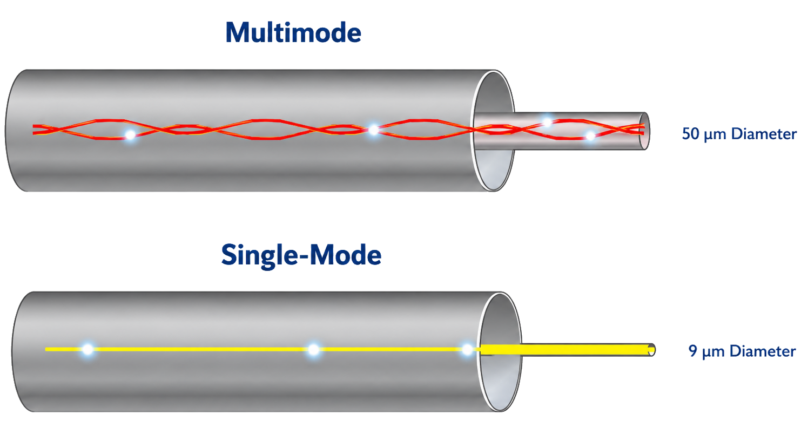
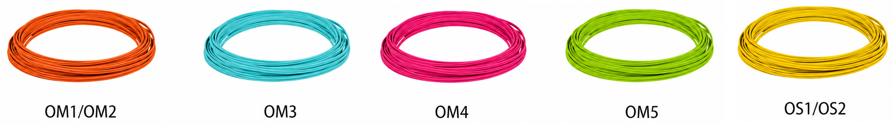
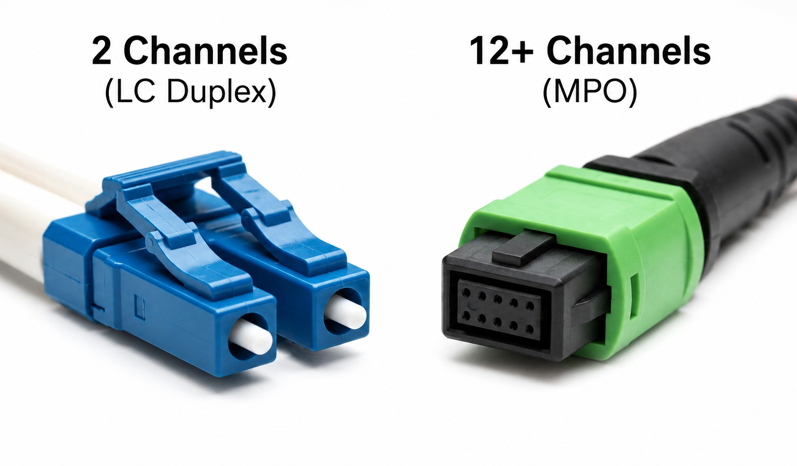

# Fiber Optics

This document covers the physical fiber medium: light propagation, bandwidth scaling, and cable identification. These concepts are platform-independent and apply wherever fiber optic cabling is used.

## Fiber Mode

Fiber mode refers to how light propagates through the glass core of a fiber optic cable. The term "mode" describes a distinct spatial path that light can follow within the core. The number of modes a fiber supports is determined primarily by the **core diameter** and the **wavelength** of light being transmitted. In practical networking, there are two categories: **Multi-Mode Fiber** (MMF) and **Single-Mode Fiber** (SMF).

### Multi-Mode Fiber (MMF)

Multi-Mode Fiber has a large core diameter, typically 50 or 62.5 µm. The wider core allows multiple light paths, or modes, to propagate simultaneously. Each mode reflects off the internal boundaries of the core at a slightly different angle, travels a slightly different total distance, and arrives at the receiver at a slightly different time. This temporal spreading of optical pulses is called **modal dispersion**. Because modal dispersion worsens with distance, MMF is limited to short-reach applications.

MMF operates at 850 nm using inexpensive **VCSELs** (Vertical-Cavity Surface-Emitting Lasers). The combination of low-cost optics and straightforward fiber termination makes MMF the standard choice for server-to-switch and rack-to-rack connections inside data centers. The exact reach depends on the fiber grade — specifically, its **modal bandwidth**, which quantifies how well the fiber's refractive index profile controls modal dispersion at a given wavelength. Higher modal bandwidth means less pulse spreading, enabling higher data rates over longer distances.

Multimode fiber is categorized into grades defined by ISO/IEC 11801:

| Grade    | Core (µm) | Modal Bandwidth (MHz·km @ 850 nm) | 100G SR4 Reach | Notes                                     |
| -------- | --------- | --------------------------------- | -------------- | ----------------------------------------- |
| **OM1**  | 62.5      | 200                               | Not supported  | Legacy, LED-optimized                     |
| **OM2**  | 50        | 500                               | Not supported  | Legacy, LED-optimized                     |
| **OM3**  | 50        | 2000                              | 70 m           | Laser-optimized (VCSEL)                   |
| **OM4**  | 50        | 4700                              | 100 m          | Laser-optimized, higher bandwidth         |
| **OM5**  | 50        | 4700 (+ wideband)                 | 100 m          | Wideband, supports SWDM wavelengths       |

OM1 and OM2 are legacy grades designed for LED-based systems and cannot support modern high-speed parallel optics. OM3 was the first grade optimized for 850 nm VCSEL lasers and remains widely deployed. OM4 improves on OM3 with higher modal bandwidth, extending 100G SR4 reach from 70 m to 100 m. OM5 adds support for **Short Wavelength Division Multiplexing (SWDM)**, which uses multiple wavelengths in the 850–953 nm range to increase bandwidth density over a single fiber pair; for standard parallel optics, its reach is identical to OM4.

For new data center deployments, OM4 is the most common choice. It provides sufficient reach for intra-building connections and is widely available at competitive pricing.

### Single-Mode Fiber (SMF)

Single-Mode Fiber has a very small core diameter of approximately 9 µm. Because the core is so narrow, only one spatial mode can propagate. This eliminates modal dispersion entirely, allowing the signal to maintain its integrity over very long distances.

SMF operates at wavelengths of 1310 nm or 1550 nm. These longer wavelengths experience lower attenuation in glass, enabling transmission over 10 km, 40 km, 80 km, or farther with appropriate optics. SMF is used for campus backbones, metropolitan networks, and inter-data-center links. The tradeoff is that single-mode optics require more precise laser sources and are generally more expensive than multimode solutions for short distances.

Because modal dispersion is absent, the key performance differentiator between SMF grades is **attenuation** — the rate at which optical power decreases per kilometer, measured in dB/km. Lower attenuation allows longer transmission distances for a given optical power budget.

Single-mode fiber is categorized into grades defined by ISO/IEC 11801:

| Grade    | Core (µm) | Attenuation (dB/km @ 1310 nm) | Attenuation (dB/km @ 1550 nm) | Cable Construction                   | Notes |
| -------- | --------- | ----------------------------- | ----------------------------- | ------------------------------------ | ----- |
| **OS1**  | 9         | ≤ 1.0                         | ≤ 1.0                         | Tight-buffered (indoor)              | Legacy, suitable for short indoor runs |
| **OS2**  | 9         | ≤ 0.4                         | ≤ 0.4                         | Loose-tube or blown (indoor/outdoor) | Current standard for all new deployments |

Both grades use the same 9/125 µm core and cladding. The difference lies in cable construction and resulting attenuation: OS1 uses tight-buffered construction intended for indoor use, while OS2 uses loose-tube or blown-fiber construction suitable for both indoor and outdoor installations. OS2's lower attenuation (less than half of OS1) makes it the preferred choice for all new installations. In practice, the transceiver optics — not the fiber grade — determine the maximum link distance for single-mode deployments.

For new installations, OS2 is the universal default.

### Jacket Color Coding

Fiber cable jackets are color-coded according to TIA-598-D to provide immediate visual identification of the fiber mode and grade without reading labels. The standard assignments are:

| Jacket Color   | Fiber Grade        |
| -------------- | ------------------ |
| **Orange**     | OM1 / OM2          |
| **Aqua**       | OM3 / OM4          |
| **Violet**     | OM4 (newer convention to distinguish from OM3) |
| **Lime Green** | OM5                |
| **Yellow**     | OS1 / OS2          |

In practice, OM4 cables are sold in either aqua or violet depending on the manufacturer and era. Both are correct for OM4. Some vendors use non-standard colors (such as green or magenta) for marketing differentiation; these cables still contain the labeled fiber grade regardless of jacket color.

## Bandwidth Scaling

A single fiber strand carries one optical signal at one wavelength by default. To achieve higher aggregate bandwidth, the industry uses two fundamentally different strategies. These strategies are independent of fiber mode — both work on multimode and single-mode fiber.

### Wavelength Multiplexing (Multiple Channels on One Fiber)

Multiple independent signals can share the same fiber simultaneously by assigning each signal a different wavelength (color) of light. This technique is called **Wavelength Division Multiplexing (WDM)**. Each wavelength acts as an independent channel that does not interfere with the others.

For example, a 100G-LR4 transceiver transmits four 25G channels at four different wavelengths (around 1310 nm) over a single fiber pair. The receiving end uses optical filters to separate the wavelengths and recover each channel independently. From a cabling perspective, WDM requires only two fibers (one TX, one RX) regardless of how many channels are multiplexed — the complexity is entirely inside the transceiver.

WDM works on both multimode fiber (Short Wavelength Division Multiplexing, or SWDM, at 850–953 nm) and single-mode fiber (CWDM and DWDM at 1270–1610 nm).

### Parallel Optics (Multiple Fibers in One Cable)

Instead of multiplexing wavelengths onto one fiber, bandwidth can also be scaled by using **multiple separate fibers in parallel**, each carrying one lane at one wavelength. This is called parallel optics.

For example, a 100G-SR4 transceiver transmits four 25G lanes on four individual fibers (and receives on four more), requiring 8 fibers total. All eight fibers are bundled into a single cable and terminated with a multi-fiber connector. Each fiber operates at the same 850 nm wavelength — there is no wavelength multiplexing involved.

### Comparison

| Strategy                | What varies                     | Cabling impact                           | Complexity location |
| ----------------------- | ------------------------------- | ---------------------------------------- | ------------------- |
| Wavelength multiplexing | Number of wavelengths per fiber | Still only 2 fibers (one TX, one RX)     | Inside the transceiver |
| Parallel optics         | Number of fiber strands         | More fibers, requires multi-fiber connector | In the cabling     |

These strategies are independent of each other and of fiber mode. A link can use single-mode fiber, carry four wavelengths per strand (WDM), and still use only two fibers — as in 100G-LR4. Or it can use multi-mode fiber, one wavelength per strand, and eight parallel fibers — as in 100G-SR4. The transceiver determines which strategy is used; the fiber cable simply provides the physical medium.

## Fiber Connectors

The bandwidth scaling strategy determines what connector the cable needs. A transceiver that uses a single fiber pair — either because it has only one lane, or because it multiplexes multiple lanes onto different wavelengths — requires a simple two-fiber connector. A transceiver that sends each lane on a separate fiber requires a multi-fiber connector.

Two connector types dominate pluggable optics deployments:

- **LC** (Lucent Connector): A small-form-factor connector that holds one fiber per ferrule. A single LC ferrule carries one fiber — this is a **simplex** connection. For bidirectional communication (one fiber to transmit, one to receive), two LC ferrules are paired together with a clip to form a **duplex LC** assembly. Duplex LC is by far the most common configuration. LC is used for:
    - Single-lane multimode links (10GBASE-SR, 25GBASE-SR) with SFP+ or SFP28 transceivers
    - Wavelength-multiplexed links that combine multiple lanes onto one fiber pair (100GBASE-LR4, 100GBASE-CWDM4, 400G-ZR)
    - Any single-mode point-to-point link

- **MPO** (Multi-fiber Push On): A connector that terminates multiple fibers in a single rectangular ferrule — typically 8, 12, or 24 fibers. MPO is used with **parallel optics** modules that transmit each lane on a dedicated fiber (such as 100GBASE-SR4, which requires 8 fibers: 4 TX + 4 RX, housed in a standard 12-fiber ferrule). MPO cabling keeps the connector count manageable even when the total fiber count is high. The terms MPO and MTP are often used interchangeably; MTP is a trademarked high-precision variant of the MPO standard manufactured by US Conec.

### MPO Gender

MPO connectors exist in two genders:

- **Male (pinned)**: Contains two guide pins that protrude from the ferrule face. Typically found on transceiver module ports.
- **Female (pinless)**: Has receptacles for the guide pins. Typically used on patch cables and trunk cables.

When connecting two transceivers (both male), the patch cable between them must be **female-to-female**. This is the standard configuration for direct device-to-device connections.

### MPO Polarity

Because MPO connectors carry multiple fibers, the transmit fibers on one end must align with the receive fibers on the other end. Three polarity methods are defined by TIA-568:

- **Type A (straight-through)**: Fiber positions are maintained 1-to-1 from one end to the other. The key orientation is the same on both ends (key up to key up). Type A cables require a duplex flip at one end of the link (typically in the patch panel or adapter) to achieve TX-to-RX alignment.

- **Type B (crossover)**: The fiber ribbon is flipped at one end, so fiber position 1 maps to position 12, position 2 to position 11, and so on. The key orientation is reversed (key up to key down). This automatically crosses TX and RX, making Type B the standard choice for direct transceiver-to-transceiver connections without intermediate patch panels.

- **Type C (pair-reversed)**: Each adjacent fiber pair is individually crossed. This is less common and primarily used in specific structured cabling designs.

### Fiber Strand Color Coding

Multi-fiber cables bundle 12 or more fibers into a single assembly. Each strand must be uniquely identifiable for splicing, testing, and troubleshooting. TIA-598 defines a 12-color sequence for fiber position numbering:

| Position | Color       |
| -------- | ----------- |
| 1        | Blue        |
| 2        | Orange      |
| 3        | Green       |
| 4        | Brown       |
| 5        | Slate (Grey)|
| 6        | White       |
| 7        | Red         |
| 8        | Black       |
| 9        | Yellow      |
| 10       | Violet      |
| 11       | Rose (Pink) |
| 12       | Aqua        |

This sequence is universal across manufacturers. For cables with more than 12 fibers, the same 12-color cycle repeats with a distinguishing mark (such as a stripe or dash) on the second group. For example, a 24-fiber ribbon uses positions 1–12 in solid colors and positions 13–24 in the same colors with a tracer stripe.

When reading a cable test report — such as those provided by manufacturers showing insertion loss and return loss per channel — the "channel" column refers to these strand colors, not the cable jacket color. Each row corresponds to a fiber at the numbered position within the connector ferrule.

## Cable Examples

The following table compares four representative fiber patch cables, each illustrating a different combination of fiber mode, grade, connector type, and jacket color. Every field corresponds to a concept covered in the preceding sections.

| Field            | FiberCablesDirect OS2 LC | CableWholesale OM3 LC | FiberCablesDirect OM4 LC | Elfcam MPO OM4 |
|------------------|--------------------------|-----------------------|--------------------------|----------------|
| Fiber mode       | Single-mode (SMF)        | Multimode (MMF)       | Multimode (MMF)          | Multimode (MMF) |
| Fiber grade      | OS2 (9/125 µm)           | OM3 (50/125 µm)       | OM4 (50/125 µm)          | OM4 (50/125 µm) |
| Connector        | LC                       | LC                    | LC                       | MPO/MTP |
| Gender           | N/A                      | N/A                   | N/A                      | Female to Female |
| Polarity         | N/A                      | N/A                   | N/A                      | Type B (crossover) |
| Fiber count      | 2                        | 2                     | 2                        | 12 |
| Duplex / Simplex | Duplex                   | Duplex                | Duplex                   | N/A (parallel) |
| Polish           | UPC                      | UPC                   | UPC                      | UPC |
| Jacket rating    | OFNR (riser)             | OFNR (riser)          | OFNR (riser)             | LSZH |
| Jacket color     | Yellow                   | Aqua                  | Violet                   | Violet |
| Length           | 5 m                      | 1 m                   | 1 m                      | 1 m |

Key observations:

- The three LC cables all show Gender as "N/A" and Polarity as "N/A" because LC is genderless and duplex LC is inherently crossed (the clip swaps fiber positions between ends).
- The MPO cable requires explicit gender (female-to-female for device-to-device) and polarity (Type B crossover for direct TX-to-RX alignment).
- For a simple lab setup connecting two SR4 transceivers on the same switch, a **Type B, female-to-female, 12-fiber OM4** MPO cable is the correct choice.
