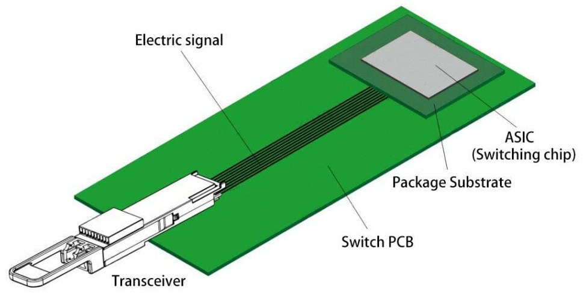
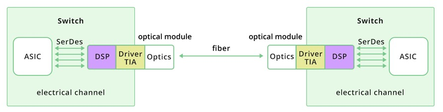
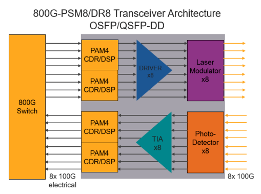
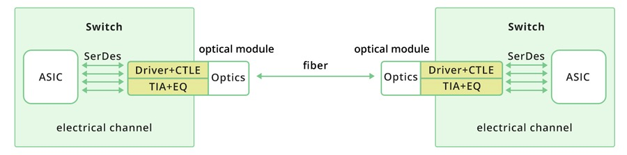

# Optical Integration Architectures

The fundamental challenge in high-speed switch design is the physical distance between the ASIC and the optical transceiver. Electrical signals degrade rapidly at modern lane rates (50–200 Gb/s) as they travel across PCB traces, vias, and connectors. The longer this electrical path, the more signal integrity is lost to attenuation, reflections, and crosstalk.

Three architectural approaches address this problem, each trading off power, complexity, and serviceability differently.

## NPO (Near-Package Optics)

Near-Package Optics (NPO) is the conventional pluggable architecture used in most switches today. The optics remain in a front-panel pluggable module (such as QSFP-DD or OSFP), with the electrical path between the ASIC and module spanning 10–30 cm. To compensate for signal degradation over this distance, the module contains a **Digital Signal Processor (DSP)** that performs equalization, clock data recovery, and signal reshaping.

- Signal path (Transmit): ASIC → SerDes → DSP → Driver → Optics → Fiber

    On the transmit side, the switch `ASIC` generates high-speed electrical data streams, typically using PAM4 modulation. These signals are serialized by the `SerDes` and travel across the switch PCB to the pluggable optical module. The module's `DSP` performs equalization and signal conditioning to clean and reshape the waveform after its lossy journey across the board. After processing, the `Driver` converts the conditioned electrical signal into a precise modulation current that drives the optical components. The `Optics` (consisting of lasers and modulators) then converts the electrical signal into modulated light and transmits it over fiber.

- Signal path (Receive): Fiber → Optics → TIA → DSP → SerDes → ASIC

    On the receive side, incoming light from the fiber enters the optical front-end, where a photodetector converts optical energy into a very small electrical current. That current is amplified by a Transimpedance Amplifier (`TIA`), which converts the current into a usable voltage signal. The `DSP` then performs equalization, noise filtering, and clock data recovery to reconstruct a clean digital bitstream. Finally, the recovered signal is passed through the `SerDes` and delivered back to the `ASIC`.

The following diagram shows the signal path in more detail:

This architecture is DSP-intensive and consumes more power compared to linear designs, but it offers high tolerance to channel imperfections. Its primary advantages are robustness, flexibility, and interoperability — the DSP decouples the module's optical performance from the host platform's electrical channel quality, meaning the same module works reliably across different switch designs. This is why NPO remains the most widely deployed solution in high-speed networking systems today.

## LPO (Linear Pluggable Optics)

LPO retains the same pluggable form factor (the module is still inserted into a standard cage) but changes the internal architecture. Instead of relying on a heavy digital signal processor (DSP) inside the module, LPO uses a more direct, linear electrical path between the ASIC SerDes and the optical components. The module performs minimal signal correction, meaning the host system must provide a cleaner, well-conditioned electrical channel.

- Signal path (Transmit): ASIC → SerDes → Driver + Linear Equalization → Optics → Fiber

    On the transmit side, the ASIC generates high-speed PAM4 signals through its SerDes lanes, which are sent directly to the module's driver stage with only lightweight linear equalization. The driver converts the electrical signal into modulation current for the optical transmitter, which then launches the signal onto the fiber. Because no DSP reshaping occurs inside the module, signal integrity depends heavily on the quality of the PCB traces, connectors, and ASIC SerDes tuning.

- Signal path (Receive): Fiber → Optics → TIA + Linear EQ → SerDes → ASIC

    On the receive side, incoming optical signals are converted into electrical current by the photodetector. The TIA (Transimpedance Amplifier) amplifies this current and applies basic linear equalization before passing the signal directly to the ASIC's SerDes. Without DSP-based recovery inside the module, the ASIC must handle tighter signal margins and compensate for any remaining impairments.

The primary advantage of LPO is reduced power consumption and lower latency compared to DSP-based pluggables. The tradeoff is increased sensitivity to system design including board layout, trace length, connector quality, SerDes calibration, and environmental stability. LPO is best suited for short-reach, high-density deployments such as AI fabrics, where power per port is critical and the cabling environment is tightly controlled.

## CPO (Co-Packaged Optics)

CPO moves optics from a removable front-panel module to optical engines placed adjacent to (or integrated with) the switch ASIC package. The electrical path between the SerDes and the optical engine becomes extremely short — millimeters instead of the 10–30 cm PCB runs in NPO — eliminating most of the signal integrity penalty associated with high-speed electrical lanes traversing long board traces and connectors.

CPO offers the best path to higher bandwidth density and lower power per bit as lane rates scale beyond 200G. The trade-off is operational and manufacturing complexity. The pluggable serviceability model is lost: replacing a failed optical engine may require removing an engine assembly, a tray, or in some designs a larger portion of the system. CPO also introduces new challenges in thermal management, manufacturing yield, production test strategy, and field replaceability.
